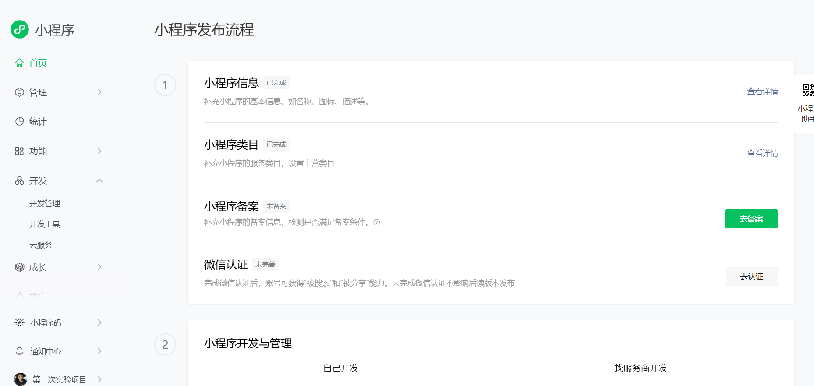
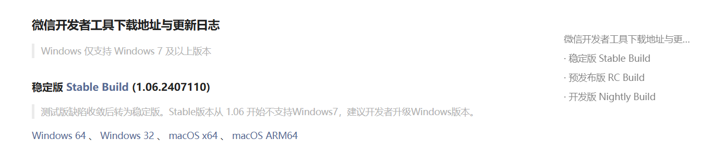
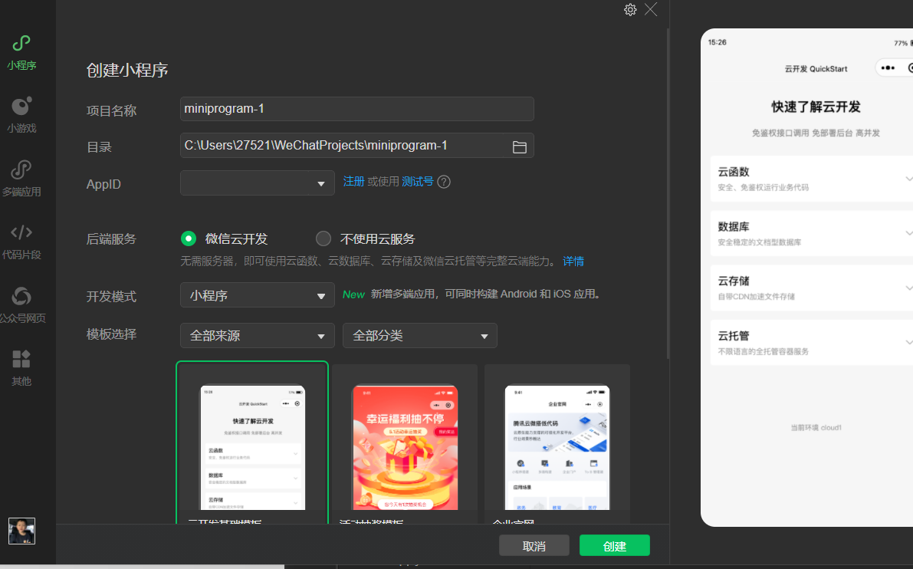

# 2024年夏季《移动软件开发》实验报告

姓名：袁佳俊  学号：22030021099

| 姓名和学号         | 袁佳俊，22030021099              |
| ------------------ | -------------------------------- |
| 本实验属于哪门课程 | 中国海洋大学22夏《移动软件开发》 |
| 实验名称           | 实验1：第一个微信小程序          |
| 博客地址           | XXXXXXX                          |
| Github仓库地址     | XXXXXXX                          |

（备注：将实验报告发布在博客、代码公开至 github 是 **加分项**，不是必须做的）

## **一、实验目标**

1、学习使用快速启动模板创建小程序的方法；2、学习不使用模板手动创建小程序的方法。

## 二、实验步骤

### 1.注册开发者账号

 1.首先访问微信公众平台注册一个小程序账号，网址是：mp.weixin.qq.com,然后点击“立即注册”

2.然后点击选择注册的类型为小程序，进入小程序的注册界面。

3.点击注册开发者账号，把相对应的信息填好，完成注册。

4.然后把小程序的对应信息给填好，完善需要填写的信息。

最后的结果是这样的：

### 2.下载开发工具

1.访问：[developers.weixin.qq.com/miniprogram/dev/devtools/download.html](https://developers.weixin.qq.com/miniprogram/dev/devtools/download.html)

2然后点开稳定版，选择相对应的电脑版本下载即可

3.按照指示登录相关信息，然后验证管理者身份，打开的界面如果是这样就正确了：

### 3.仿照模版实现简单的小程序

1.自行选择相应的创建位置和模版

2.appID：管理员在微信公众平台注册的小程序id，如果只是测试一下的话，就可以选择测试号

3.进去后就是这样的界面：

## 三、程序运行结果

列出程序的最终运行结果及截图。

## 四、问题总结与体会

描述实验过程中所遇到的问题，以及是如何解决的。有哪些收获和体会，对于课程的安排有哪些建议。