# 2024年夏季《移动软件开发》实验报告

姓名：袁佳俊  学号：22030021099

| 姓名和学号         | 袁佳俊，22030021099                                          |
| ------------------ | ------------------------------------------------------------ |
| 本实验属于哪门课程 | 中国海洋大学24夏《移动软件开发》                             |
| 实验名称           | 实验3：微信小程序云开发（垃圾识别小程序）                    |
| 博客地址           | http://t.csdnimg.cn/Aw5L0                                    |
| Github仓库地址     | [移动软件开发: 本仓库为2024夏移动软件开发的实验分享仓库 (gitee.com)](https://gitee.com/yuan-jiajunun/mobile-software-development) |

## **一、实验目标**

1、学习不使用模板手动创建小程序的方法。

2.学习使用微信小程序完成垃圾识别的工作。

3.学习微信小程序云开发的基础知识。能够完成利用文本搜索的功能和图像识别。

## 二、实验步骤

### 1.学习了解云开发的基本知识

我们可以访问以下的链接简单学习微信程序云开发：[关于微信小程序云开发以及云开发实例展示 | 微信开放社区 (qq.com)](https://developers.weixin.qq.com/community/develop/article/doc/0008aa90bc4e68c6a39f8b7e956813)

### 2.自己创建一个云开发环境

随便创建一个项目，然后点击图片中的云开发按钮

然后点击注册云开发环境，填好环境名称，免费体验一个月：

如果出现这样的界面就代表注册成功了：

### 3.注册百度云账号并领取免费资源

点击链接： **[注册百度智能云并实名认证, 创建一个图像识别应用, 记录应用API KEY 和 SECRET KEY, 创建资源之后记得领取免费资源](https://gitee.com/link?target=https%3A%2F%2Fconsole.bce.baidu.com%2Fai%2F%3F_%3D%26fromai%3D1%23%2Fai%2Fimagerecognition%2Fapp%2Fcreate)**

注册实名认证后，点击领取免费资源：

注意后续的API key和Sercet Key十分有用，然后打开微信开发程序，打开云开发，找到环境id，把他复制下来：

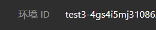

在app.js文件中找到图示位置，把环境id复制下去，注意不要手搓，特别容易出错，

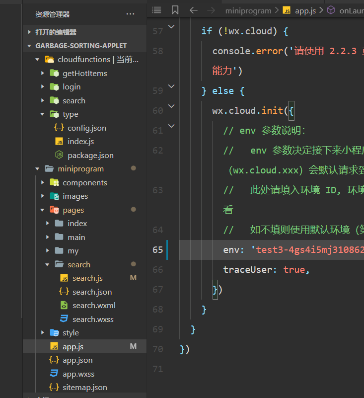

### 4.**进入微信开发者工具导入垃圾分类小程序项目**

注意我这里导入的是包含cloudfunctions,miniprogram,project.config.json的整个文件夹，把整个文件夹内容导入下来，会得到以下内容：

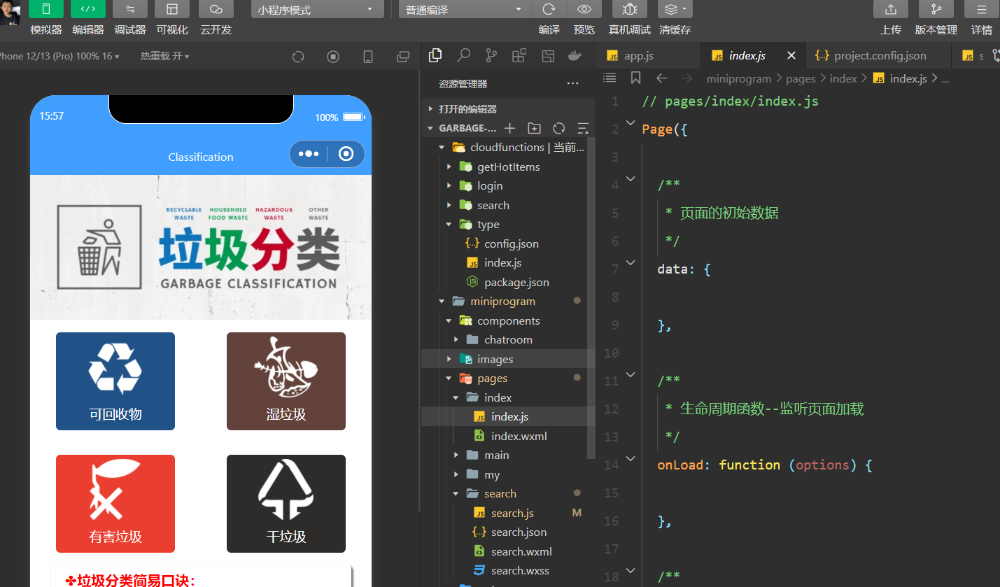

按图示填好自己微信的appid和API key和Sercet Key：

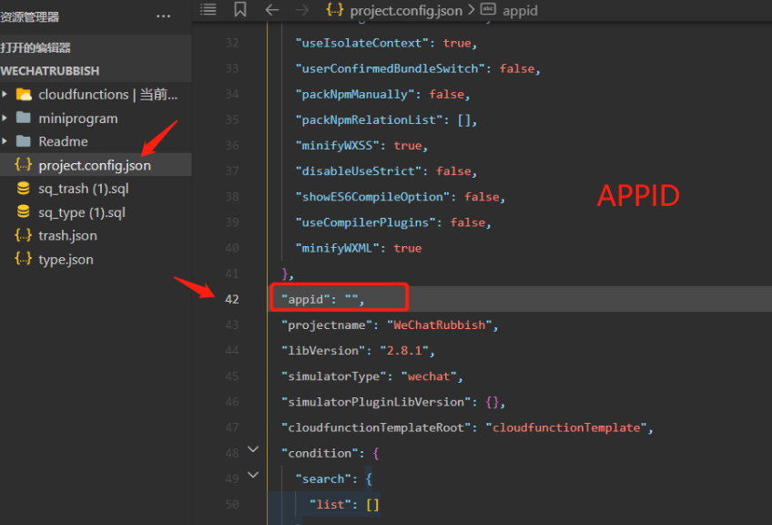

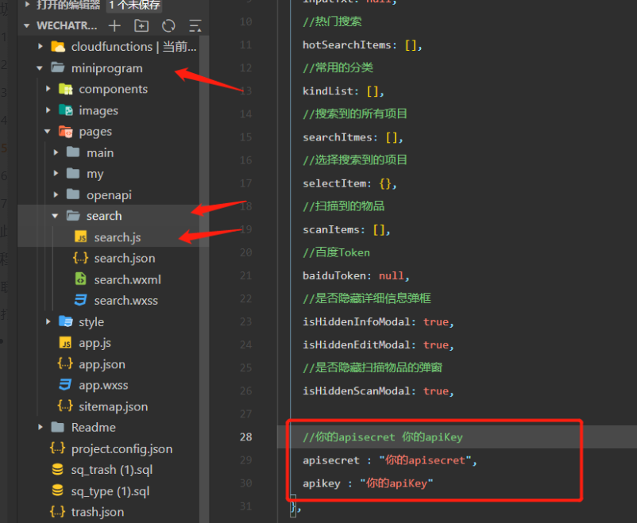

### 5.部署云函数

找到图示的位置，然后点击云开发上传依赖项：

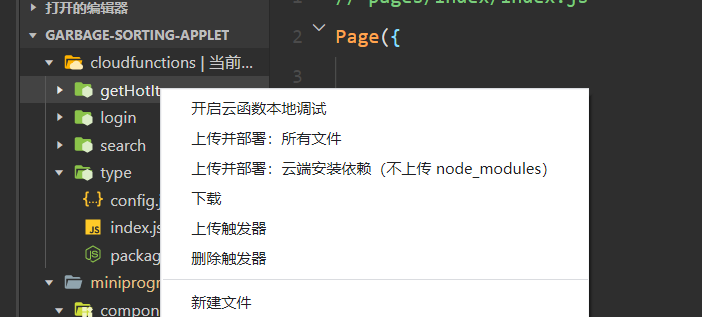

最后找到云开发的云函数可以检查是否部署到位：

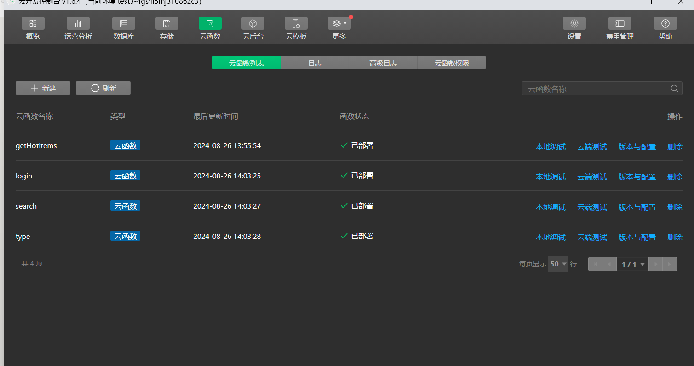

如果出现上图效果，则表示云函数部署成功。

### 6.创建数据库

找到云开发的地方，点击数据库，点击图示位置的加号：

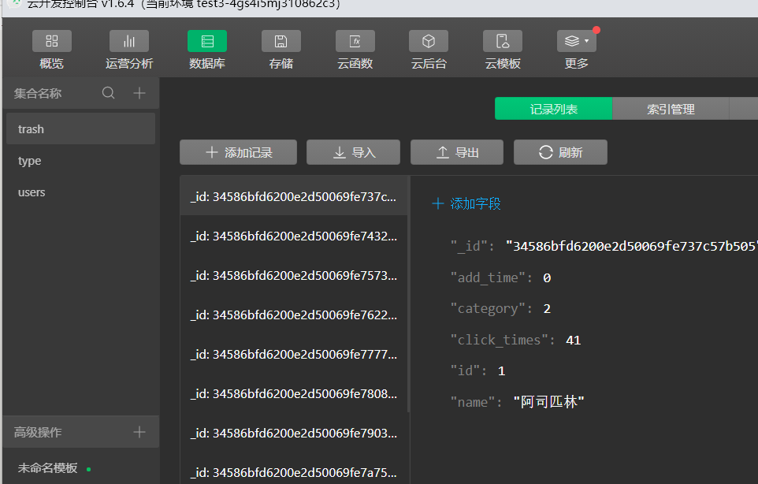

创建一个数据库，trash，type：

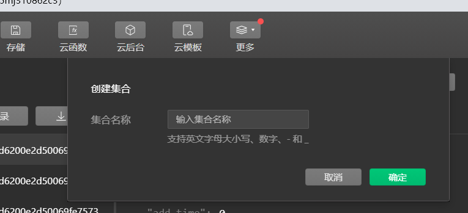

导入trash.json和type.json文件，数据库就构建完毕了。

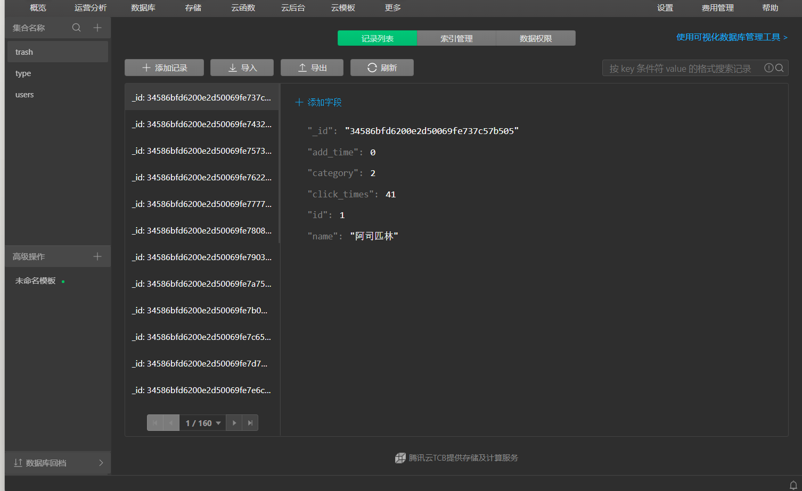

到这就整个项目构建完毕了，可以点击小程序中的搜索上传图片或者检索文本。

## 三、程序运行结果

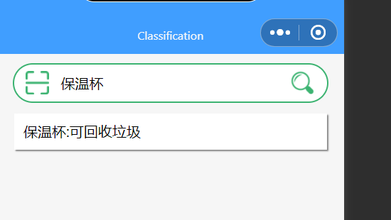

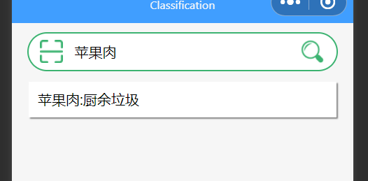

对这张图片的检索结果为：

.png)

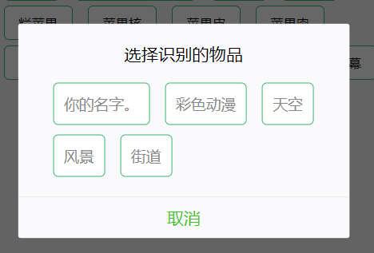

## 四、问题总结与体会

### 问题与解决办法

#### 1. **识别准确率**

-  **困难**：提高物品和垃圾识别的准确率是核心问题。由于不同的物品在外观上可能相似，识别时可能会出现误差。
-  **解决办法**：借助一些代码还有多使用小程序训练算法，或者求助于人工智能。

#### 2. **网络问题**

-  **困难**：用户在网络不稳定或无网络的情况下，可能无法使用小程序的识别功能。
-  **解决办法**：提醒用户在有网络连接的情况下使用

#### 3.代码接口的问题

-  **困难**：识别图像的接口有点问题，无法准确的识别，总是显示无法识别物体
-  **解决办法**：在百度云那边领取一下专门识别的免费资源，再去小程序里调用api即可解决问题。

### 收获和体会

**实践中学习**：通过实际开发微信小程序，深入了解了微信云开发的功能和使用场景，掌握了云数据库的基本操作和优化技巧。同时也对云开发有着深深地兴趣，我也懂得了云数据库和云函数的使用场景，也对他了解的越来越多，我的个人项目也会用到云开发，以巩固学习。

**解决问题的能力**：在面对各种技术难题时，通过不断学习和实践，提升了自己分析问题和解决问题的能力。
