# 2024年夏季《移动软件开发》实验报告


<center>姓名：袁佳俊  学号：22030021099</center>

| 姓名和学号         | 袁佳俊，22030021099                                          |
| ------------------ | ------------------------------------------------------------ |
| 本实验属于哪门课程 | 中国海洋大学24夏《移动软件开发》                             |
| 实验名称           | 实验2：查询天气小程序                                        |
| 博客地址           | http://t.csdnimg.cn/vSong                                    |
| Github仓库地址     | [移动软件开发: 本仓库为2024夏移动软件开发的实验分享仓库 (gitee.com)](https://gitee.com/yuan-jiajunun/mobile-software-development) |


## **一、实验目标**

1、学习使用快速启动模板创建小程序的方法。

2、学习不使用模板手动创建小程序的方法。

3.学习使用微信小程序完成天气查询的工作。


## 二、实验步骤

### 1.API密钥申请

首先访问[和风天气 | 商业气象服务商, 天气预报，灾害预警，台风路径，卫星云图，天气API/SDK/APP, 天气插件, 历史天气, 气象可视化 (qweather.com)](https://www.qweather.com/)，然后注册登录，登录后就可以访问https://console.qweather.com/，点击项目管理，然后创建项目即可，最后的结果是这样的：

选择免费订阅：

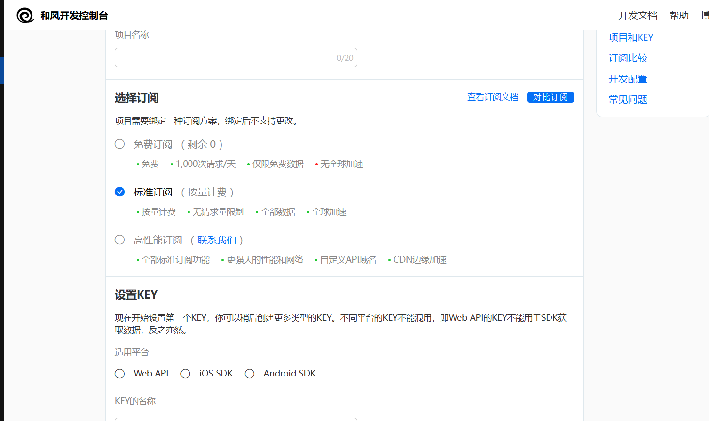

注册成功就是这样：

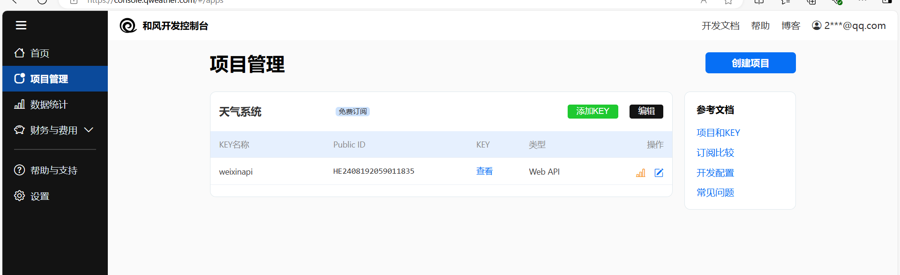


### 2.API域名调用

这个是免费订阅的api接口：[devapi.qweather.com/v7/weather/now](https://devapi.qweather.com/v7/weather/now)，它需要两个或者更多的参数才能有访问的结果，其中一个是location，还有一个是key，location是对应的城市的编号，而key则是我们免费订阅的密钥，具体可以在此查询：

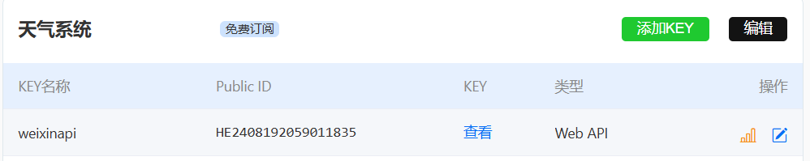

点击即可查询，但是注意密钥不要泄露。

例如查询[devapi.qweather.com/v7/weather/now?location=101010100&key=6c468480cc4e455f9a3930212f5224f5](https://devapi.qweather.com/v7/weather/now?location=101010100&key=6c468480cc4e455f9a3930212f5224f5)，在浏览器输入即可得到以下答复

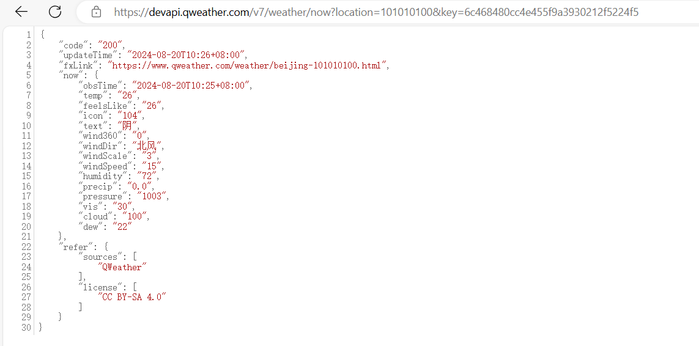

这是一些数据的参数和返回值：

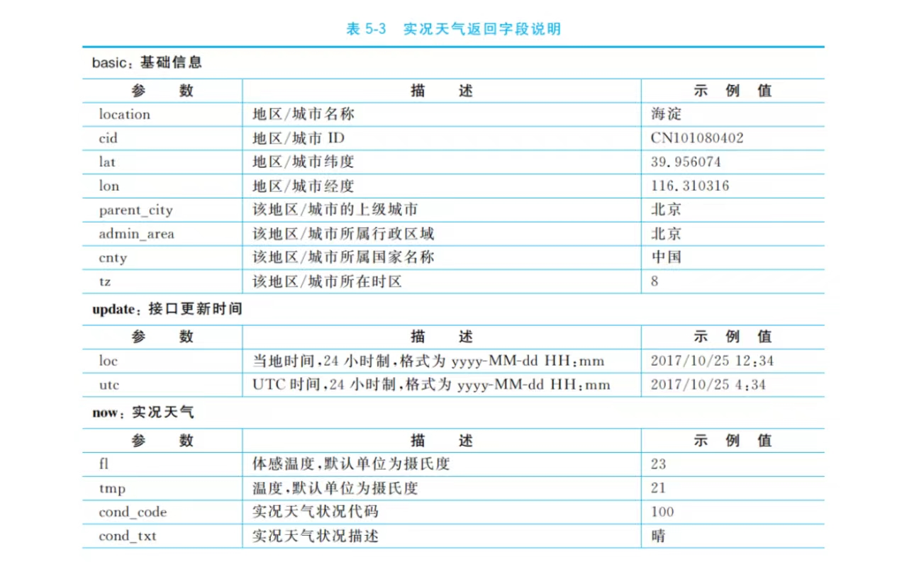

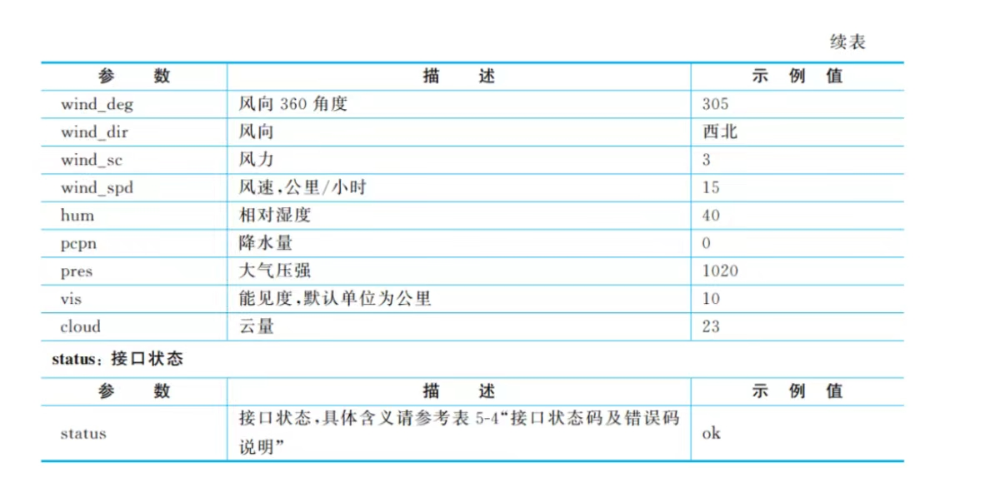


### 3.服务器域名配置

访问微信开发平台，找到开发管理->开发设置，往下滑找到服务器域名，然后在第一个那填写

-  https://devapi.qweather.com
-  https://geoapi.qweather.com

保存即可

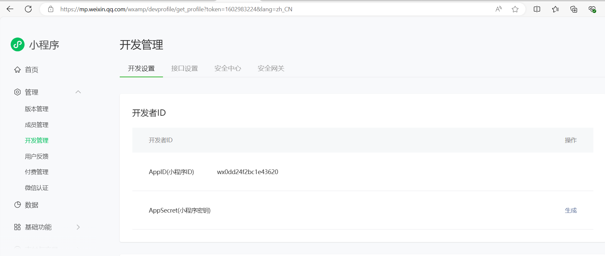


### 4.项目创建

1.按照图示创建项目即可，注意不要使用任何模板


2.删除和修改文件：

​	1）删除index.wxml和index.wxss的全部代码

​	2）删除index.js的代码，然后输入page补全代码：

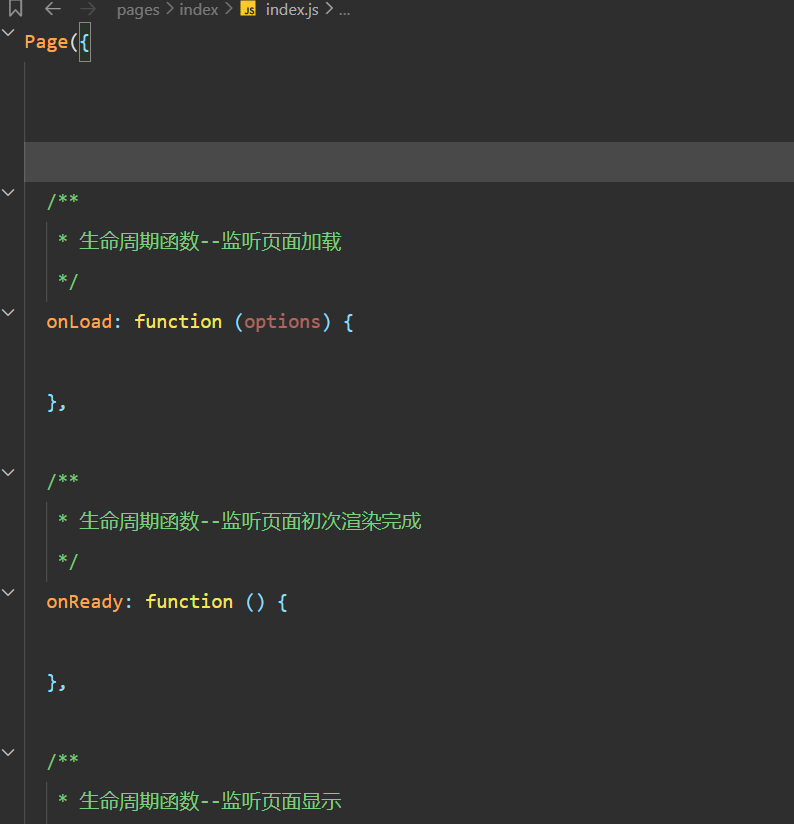

​	3）删除app.js的代码，输入app补全函数，具体操作同上


3.导航栏设计

在app.json文件中增加以下代码：

```javascript
{
  "pages": [
    "pages/index/index"
  ],
  "window": {
    "navigationBarBackground": "#3883FA",
    "navigationBarTitleText": "今日天气"
  }
}
```

最后渲染的结果如下：

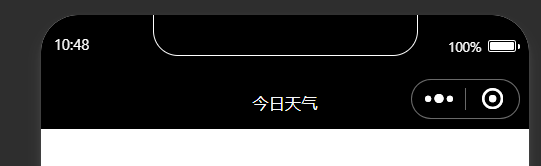

4.创建一个imags目录，然后在这个目录下在建一个二级目录weather_icon，然后去和风天气官网下载好天气图片，解压在二级目录下即可，如下图显示：

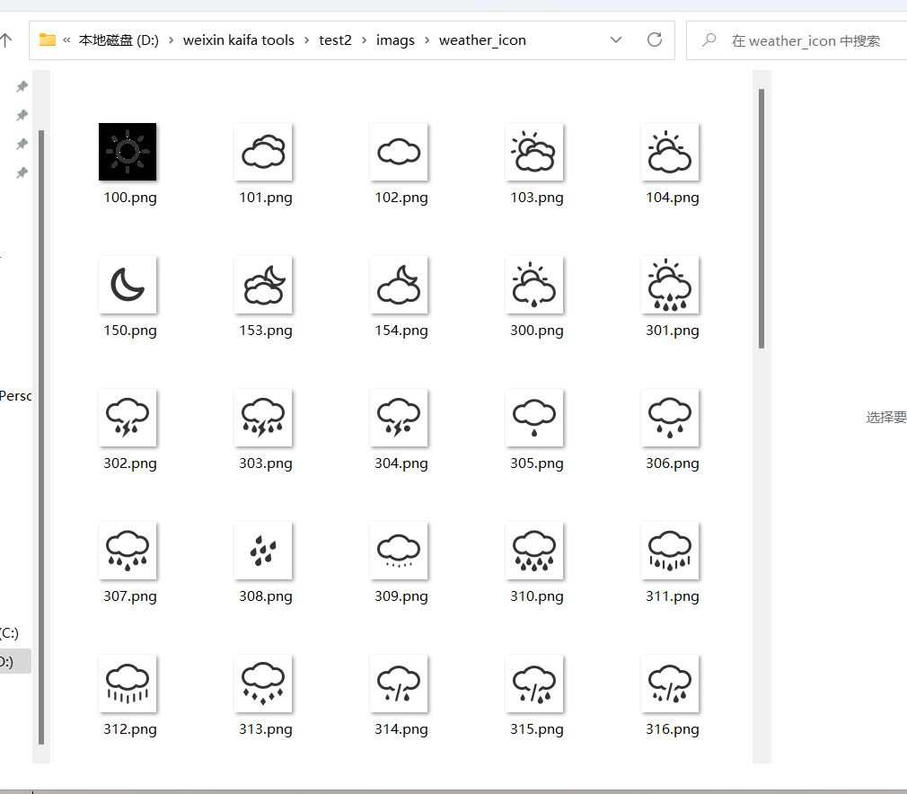


### 5.页面设计

首先在index.wxml文件中增加以下代码：


```
<view class="container">
</view>
```

然后在app.wxss文件中增加以下代码：

```javascript
.container{
  height: 100vh;
  display: flex;
  flex-direction: column;
  align-items: center;
  justify-content: space-around;
}
```

这样一来我们的容器就设置好了，然后我们需要将index.wxml文件中修改添加一下内容：

```javascript
<view class="container">
  <!-- 区域1：地区选择器 -->
  <picker mode="region"bindchange = 'regionChange'>
    <view>{{region}}</view>
  </picker>

  <!-- 区域2：单行天气信息 -->
  <text> {{now.temp}}°C {{now.cond_txt}} </text>

  <!-- 区域3：天气图标 -->
  <image src= "/imags/weather_icon/{{now.icon}}.png" mode="widthFix"></image>

  <!-- 区域4：多行天气信息 -->
  <view class="detail">
    <view class="bar">
      <view class="box">湿度</view>
      <view class="box">气压</view>
      <view class="box">能见度</view>
    </view>>
    <view class="bar">
      <view class="box">{{now.humidity}} %</view>
      <view class="box">{{now.pressure}} hPa</view>
      <view class="box">{{now.vis}} km</view>
     </view>
     <view class="bar">
      <view class="box">风向</view>
      <view class="box">风速</view>
      <view class="box">风力</view>
     </view>
     <view class="bar">
      <view class="box">{{now.windDir}}</view>
      <view class="box">{{now.windSpeed}} km/h</view>
      <view class="box">{{now.windScale}} 级</view>
     </view>
  </view>
</view>
```

然后我们需要在index.wxss文件中增加以下内容：

```
/* 图标样式 */
image{
  width: 220rpx;
}
```

这样我们的初始默认结果就是：

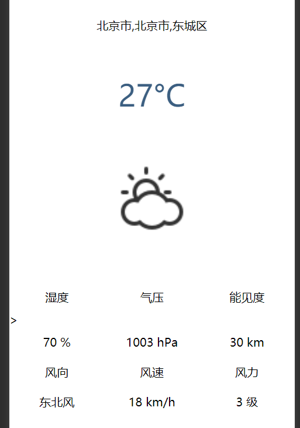


### 6.逻辑实现

首先在index.wxml中增加<picker>组件，追加自定义bindchange事件，具体修改如下：

```javascript
<!-- 区域1：地区选择器 -->
  <picker mode="region"bindchange = 'regionChange'>
    <view>{{region}}</view>
  </picker>
```

然后我们需要再index.js文件中增加内容：

```javascript
 data: {
    region:['安徽省','芜湖市','镜湖区']
  },
  regionChange:function(e){
    this.setData({region: e.detail.value});
    this.getWeather();
  },
```

然后的结果如下显示：

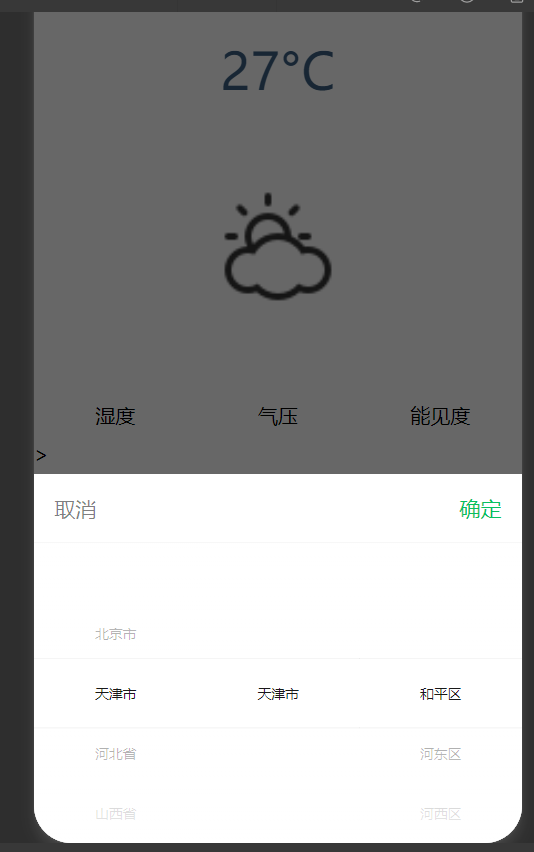

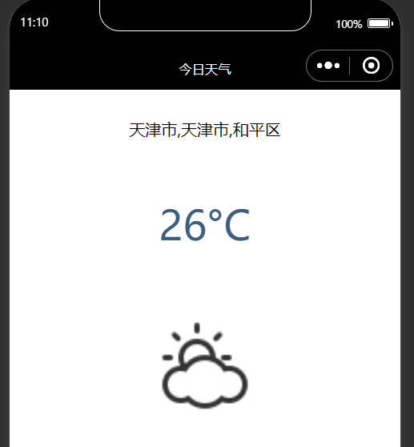


### 7.获取实际的天气数据

我们需要自定义getWeather函数实时获取天气，所以我们在index.js文件中修改代码：

```javascript
getWeather:function(){
    var that = this;
    
    // 先通过地名获取 Location ID
    wx.request({
      url: 'https://geoapi.qweather.com/v2/city/lookup',
      data: {
        location: that.data.region[1],  // 使用地名
        key: '6c468480cc4e455f9a3930212f5224f5'
      },
      success: function(res) {
        // 获取 Location ID
        var locationId = res.data.location[0].id;
        
        // 使用 Location ID 查询天气
        wx.request({
          url: 'https://devapi.qweather.com/v7/weather/now',
          data: {
            location: locationId,
            key: '6c468480cc4e455f9a3930212f5224f5',
            adm: that.data.region[1] // 使用地名
          },
          success: function(res) {
            console.log(res.data);
            that.setData({now:res.data.now});
          }
        })
      }
    });
  },
```

**初始流程：** 小程序的 `getWeather` 函数原本直接使用地名（如“芜湖市”）来获取天气信息。然而，和风天气 API 实际上更倾向于通过一个唯一的 Location ID（位置编号）来查询天气，而不是直接使用地名。因此，需要首先将地名转换为相应的编号。

**获取 Location ID：** 为了实现这一点，首先需要调用和风天气提供的 `GeoAPI` 接口。这个接口允许用户通过提供地名（例如“芜湖市”）来获取对应的 Location ID。小程序通过发送一个 HTTP 请求，传递地名参数和 API 密钥，查询到地名对应的 Location ID。

**使用 Location ID 查询天气：** 一旦得到了 Location ID，小程序就可以使用这个 ID 进行天气查询。再一次发出请求，这次是向和风天气的天气查询接口发送请求，提供 Location ID 和 API 密钥来获取对应位置的实时天气数据。

返回实时结果如下：

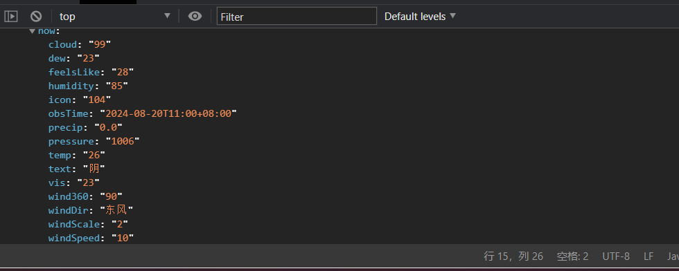

然后将所有的临时数据修改为{{now.属性}}具体如下：

```javascript
<view class="container">
  <!-- 区域1：地区选择器 -->
  <picker mode="region"bindchange = 'regionChange'>
    <view>{{region}}</view>
  </picker>

  <!-- 区域2：单行天气信息 -->
  <text> {{now.temp}}°C {{now.cond_txt}} </text>

  <!-- 区域3：天气图标 -->
  <image src= "/imags/weather_icon/{{now.icon}}.png" mode="widthFix"></image>

  <!-- 区域4：多行天气信息 -->
  <view class="detail">
    <view class="bar">
      <view class="box">湿度</view>
      <view class="box">气压</view>
      <view class="box">能见度</view>
    </view>>
    <view class="bar">
      <view class="box">{{now.humidity}} %</view>
      <view class="box">{{now.pressure}} hPa</view>
      <view class="box">{{now.vis}} km</view>
     </view>
     <view class="bar">
      <view class="box">风向</view>
      <view class="box">风速</view>
      <view class="box">风力</view>
     </view>
     <view class="bar">
      <view class="box">{{now.windDir}}</view>
      <view class="box">{{now.windSpeed}} km/h</view>
      <view class="box">{{now.windScale}} 级</view>
     </view>
  </view>
</view>
```

这样这个实验就算是完美完成了。

## 三、程序运行结果

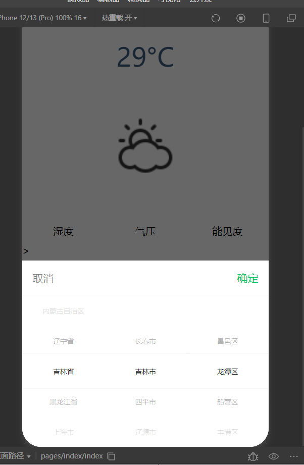

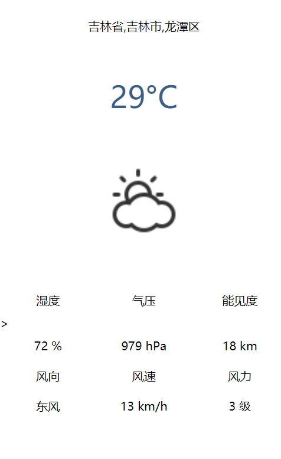

## 四、问题总结与体会

### 问题与解决办法

#### 1. **地名转换为 Location ID**

**问题：** 原始给出的解决办法是使用地名，但是现在调用查询必须是地名的标号，所以我们必须重新写一个程序，将地名转化为编号。

**解决办法：**

-  使用https://geoapi.qweather.com/v2/city/lookup来查询地名所对应的编号，然后再查询一次，将编号对应进去，查询新的结果即可。


#### 2. **API 返回错误或无数据**

**问题：** 调用 API 获取天气信息时，返回错误或没有数据（例如 API 返回空对象）。

**解决办法：**

-  **检查 API 返回值：** 在每次请求后，仔细检查返回值，捕获和处理可能的错误信息，确保用户能够得到准确的反馈。
-  **设置默认数据：** 当 API 无法提供数据时，显示默认天气信息或提示用户稍后重试。


### 收获和体会


1.**深入理解 API 使用：** 通过调用和风天气 API，将获得如何正确构建和发送 HTTP 请求、处理响应数据的经验。我了解到不同类型的 API 请求和它们的使用场景。

2.**实验对比：**对比上次的实验，我这次发现实验的步骤大差不差，但是有些细节方面的内容变得更加细致，原始的操作文档也无法满足我们现在的编写要求，文档时间比较久远，比如说查询天气的api的参数:location,文档说明的是地名，但是现在我们所使用的参数则是地名的对应的编号，所以这个地方就和我们之前的区别比较大，还有就是我们对实时数据进行赋值的时候，发现它的数据名字是对不上的，需要自己在调试appdata中找到正确的名字，然后自己修改，通过这次实验，我也加深了自己创建小程序的理解和感悟，对这些知识有了更加多的认识。 