# 2024年夏季《移动软件开发》实验报告


<center>姓名：袁佳俊  学号：22030021099</center>

| 姓名和学号         | 袁佳俊，22030021099                                          |
| ------------------ | ------------------------------------------------------------ |
| 本实验属于哪门课程 | 中国海洋大学24夏《移动软件开发》                             |
| 实验名称           | 实验5：高校新闻网                                            |
| 博客地址           | http://t.csdnimg.cn/VmgKg                                    |
| Github仓库地址     | [移动软件开发: 本仓库为2024夏移动软件开发的实验分享仓库 (gitee.com)](https://gitee.com/yuan-jiajunun/mobile-software-development) |


## **一、实验目标**

 1、综合所学知识创建完整的前端新闻小程序项目

2、能够在开发过程中熟练掌握真机预览、调试等操作。


## 二、实验步骤

### 1.项目创建

首先我们先创建好项目，不使用云服务，不使用模板：

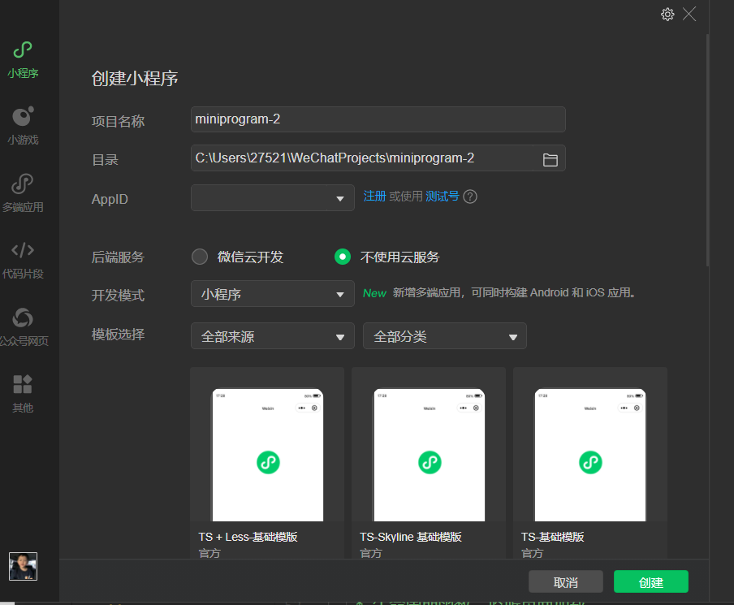

然后我们删除index.js 和index.wxml文件的全部内容，然后我们在app.js文件内输入app，在index.js补全函数page即可，


然后我们需要创建一个文件夹创建一个images，里面放上一张图片，图片下载的地址为：

https://gaopursuit.oss-cn-beijing.aliyuncs.com/2022/demo4_file.zip

下载好放入即可

我们还需要创建一个utiles文件夹，里面放入common.js文件，文件内容的下载位置如下：

https://gaopursuit.oss-cn-beijing.aliyuncs.com/2022/demo4_file.zip


最后的结果如下：

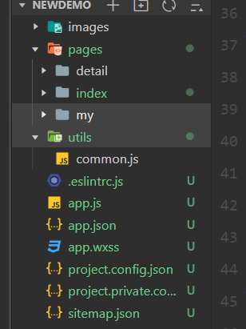

### 2.导航栏设计

我们在app.ison文件里添加如下内容：

```javascript
  "pages": [
    "pages/index/index",
    "pages/detail/detail",
    "pages/my/my"
  ],
  "window": {
    "navigationBarBackgroundColor": "#328EEB",
    "navigationBarTitleText": "我的新闻网",
    "navigationBarTextStyle": "white"
```

实现后的结果如下：

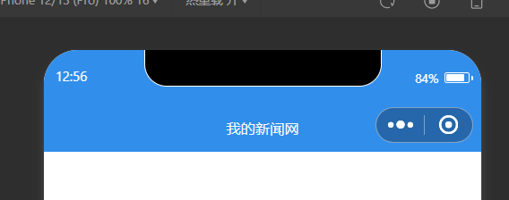

然后我们在该文件下添加tabbar以及相关属性：

```javascript
 "tabBar": {
    "color": "#000",
    "selectedColor": "#328EEB",
    "list": [
      {
        "pagePath": "pages/index/index",
        "iconPath": "images/index.png",
        "selectedIconPath": "images/index_blue.png",
        "text": "首页"
      },
      {
        "pagePath": "pages/my/my",
        "iconPath": "images/my.png",
        "selectedIconPath": "images/my_blue.png",
        "text": "我的"
      }
    ]
  }
```

然后我就可以看到如下渲染结果：

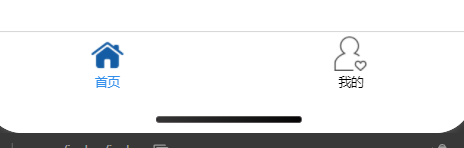

这样我们就可以点击不同的按钮切换不同的页面了。


### 3.页面设计

我们想要设计如下的模型页面：


所以我们需要先在index.wxml文件中添加一=以下代码：

```html
  <swiper indicator-dots="true" autoplay="true" interval="5000" duration="500">
    <block wx:for="{{swiperImg}}" wx:key="swiper{{index}}">
      <swiper-item>
        <image src="{{item.src}}" class="slide-image"/>
      </swiper-item>
    </block>
  </swiper>

  <view id='news-list'>
    <view class="list-item" wx:for="{{newsList}}" wx:for-item="news" wx:key="{{news.id}}">
      <image src="{{news.poster}}"></image>
      <text bindtap='goToDetail' data-id='{{news.id}}'>*{{news.title}} --{{news.add_date}}</text>
    </view>
  </view>
```

还有一些css样式代码：

```css
swiper{
  height:400rpx;
}

swiper image{
  width:100%;
  height:100%;
}

#news-list{
  min-height:600rpx;
  padding: 15rpx;
}

.list-item{
  display:flex;
  flex-direction: row;
  border-bottom: 1rpx solid gray;
}

.list-item image{
  width:230rpx;
  height:150rpx;
  margin:10rpx;
}

.list-item text{
  width:100%;
  line-height: 60rpx;
  font-size:10pt;
}
```

同时在index.js页面中添加数据路径：

```javascript
  data: {
    //幻灯片素材
    swiperImg: [
      {src: 'http://news.ouc.edu.cn/_upload/article/images/dd/19/ede76a4a4ebdb1d3ab278a12fdd8/9bb154f8-e33b-421a-b453-82c758a32405.jpg'},
      {src: 'https://news.ouc.edu.cn/_upload/article/images/3a/4d/73b22a9b404f93e907238f2a2325/55606b28-53b8-412f-9420-74c7a30657b6.jpg'},
      {src: 'https://news.ouc.edu.cn/_upload/article/images/94/9e/509119874e5287e8c56ef708865b/11604054-e936-468b-a50e-a4233e475a53.jpg'}
    ],
    newsList:[{
      id:'264698',
      title:'中国海大志愿者完成第五届跨国公司领导人青岛峰会志愿服务',
      poster:'http://news.ouc.edu.cn/_upload/article/images/dd/19/ede76a4a4ebdb1d3ab278a12fdd8/9bb154f8-e33b-421a-b453-82c758a32405.jpg',
      add_data:'2022-03-05'
    }]
  },

```

完成以下步骤后我们就可以得到以下页面了；

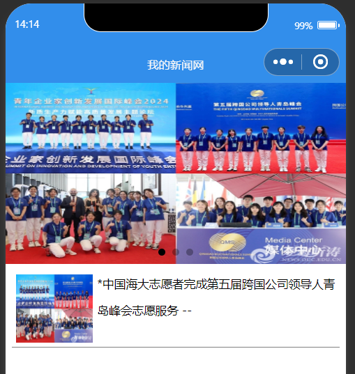

为了让我们的“我的”页面变得更加独特，我们需要往my.js还有my.wxml还有my.wxss代码中添加以下代码：

```html
<!--pages/my/my.wxml-->
<view id='myLogin'>
  <block wx:if="{{isLogin}}">
    <image id="myIcon" src='{{src}}'></image>
    <text id="nickName">{{nickName}}</text>
  </block>
  <button wx:else open-type="getUserInfo" bindgetuserinfo="getMyInfo">未登录，点此登录</button>
</view>

<view id='myFavorites'>
  <text>我的收藏({{num}})</text>
  <view id="nows-list">
    <view class="list-item" wx:for="{{newsList}}" wx:for-item="news" wx:key="{{news.id}}">
      <image src="{{news.poster}}"></image>
      <text bindtap="goToDetail" data-id='{{news.id}}'>*{{news.title}}--{{news.add_date}}</text>
    </view>
  </view>
</view>
```

```css
/* pages/my/my.wxss */
#myLogin{
  background-color: #328EEB;
  height: 400rpx;
  display:flex;
  flex-direction: column;
  align-items: center;
  justify-content: space-around;
}

#myIcon{
  width: 200rpx;
  height:200rpx;
  border-radius: 50%;
}

#nickName{
  color: white;
}

#myFavorites{
  padding: 20rpx;
}
```

在my.js代码中添加数据内容：

```javascript
data: {
    nickName:'未登录',
    src:"/images/index.png",
    newsList:[{
      id:'264698',
      title:'中国海大志愿者完成第五届跨国公司领导人青岛峰会志愿服务',
      poster:'http://news.ouc.edu.cn/_upload/article/images/dd/19/ede76a4a4ebdb1d3ab278a12fdd8/9bb154f8-e33b-421a-b453-82c758a32405.jpg',
      add_data:'2022-03-05'
    }]
  },
```

于是我们可以看到以下画面：

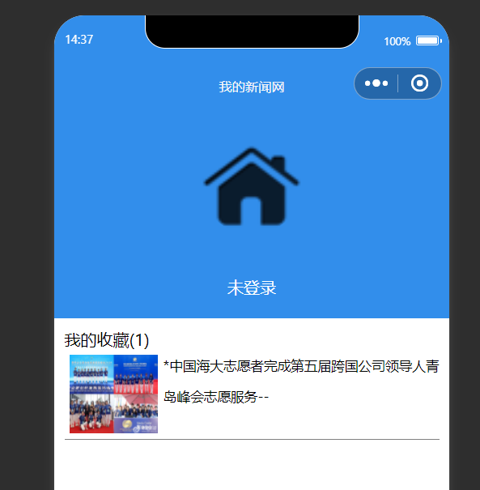


接着我们对detail页面进行修改

```html
<!--pages/detail/detail.wxml-->
<view class='container'>
  <view class='title'>{{article.title}}</view>
  <view>
    <image src="{{article.poster}}" mode="widthFix"/>
  </view>
  <view class='content'>{{article.content}}</view>
  <view class='add_date'>时间:{{article.add_date}}</view>
  <button wx:if='{{isAdd}}' plain bind:tap="cancalFavorites">已收藏</button>
  <button wx:else plain bind:tap="addFavorites">点击收藏</button>
</view>
```

还有detail.wxss页面：

```css
/* pages/detail/detail.wxss */
.container{
  padding: 15rpx;
  text-align: center;
}
.title{
  font-size: 14pt;
  line-height: 80rpx;
}
.poster image{
  width: 700rpx;
}
.content{
  text-align: left;
  font-size: 12pt;
  line-height: 60rpx;
}
.add_date{
  font-size: 12pt;
  text-align: right;
  line-height: 30rpx;
  margin-right: 25rpx;
  margin-top: 20rpx;
}
button{
  width: 250rpx;
  height: 100rpx;
  margin: 20rpx auto;
}

```


同时我们在detail.js页面中添加数据：

```javascript
data: {
    article:{
      id:'264698',
      title:'测试标题',
      poster:'https://news.ouc.edu.cn/_upload/article/images/dd/19/ede76a4a4ebdb1d3ab278a12fdd8/9bb154f8-e33b-421a-b453-82c758a32405.jpg',
      content:'测试测试测试测试测试测试测试测试测试测试测试测试测试测试测试测试测试测试测试测试测试测试测试测试测试测试测试测试',
      add_date:'2024-09-02',
      num:0
    }
  },
```

这样一来我们户可以看到这一条新闻的具体内容了：

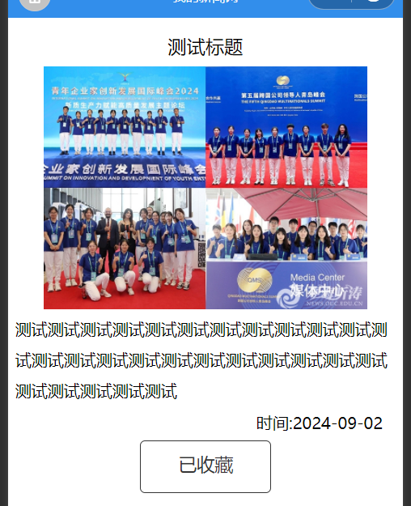


### 4.逻辑实现

首先我们直接把下载好的common.js文件内容复制在utils文件夹内，

```javascript
//模拟新闻数据
const news = [
  {id: '264698',
  title: '省退役军人事务厅来校交流对接工作',
  poster: 'https://gaopursuit.oss-cn-beijing.aliyuncs.com/2022/newsimage1.jpg',
  content: ' 8月19日，省退役军人事务厅二级巡视员蔡元和、办公室主任刘恒贵、就业创业处副处长钟俊武一行来校就联合共建安徽退役军人学院事宜进行交流对接。校党委常委、副校长陆林，芜湖市退役军人事务局党组成员、副局长张桂芬，学校办公室、人事处、教务处、招就处、学生处、研究生院、体育学院负责同志参加会议。',
  add_date: '2022-08-19'},
  {id: '304083',
  title: '《光明日报》刊发我校研究员王顺理论文章《不断提高理论素养》',
  poster: 'https://gaopursuit.oss-cn-beijing.aliyuncs.com/2022/newsimage2.jpg',
  content: ' 8月9日，《光明日报》第06版“学习贯彻习近平新时代中国特色社会主义思想专刊”版面长篇幅刊发了我校中国特色社会主义理论体系研究中心特约研究员、马克思主义学院博士生王顺题为《不断提高理论素养》的理论文章。文章从“理论素养坚实，才能理想信念坚定”“克服前进道路上的各种困难，需要具备扎实的理论素养”“提升理论素养，必须学懂弄通做实党的创新理论”3个方面全面阐述了不断提高理论素养、坚持用党的创新理论武装头脑的重要性。文章指出，新征程上，面对具有新的历史特点的伟大斗争，迫切需要我们学懂弄通做实党的创新理论，以扎实的理论素养提升战略定力、斗争能力，从而不断取得新的伟大胜利。',
  add_date: '2022-08-09'},
  {id: '305670',
  title: '我校在第八届安徽省“互联网+”大学生创新创业大赛再创佳绩',
  poster: 'https://gaopursuit.oss-cn-beijing.aliyuncs.com/2022/newsimage3.jpg',
  content: '7月4日—8月10日，由安徽省教育厅、合肥市人民政府、淮北市人民政府联合主办的第八届安徽省“互联网+”大学生创新创业大赛暨中国国际“互联网+”大学生创新创业大赛选拔赛在线上举办。我校参赛项目团队历经省级复赛网评、决赛路演答辩、金奖排位赛等多轮次比拼，斩获金奖3项、银奖10项、铜奖23项，其中3个项目由省赛组委会推荐入围国赛。',
  add_date: '2022-08-11'}
];

//获取新闻列表
function getNewsList() {
  let list = [];
  for (var i = 0; i < news.length; i++) {
    let obj = {};
    obj.id = news[i].id;
    obj.poster = news[i].poster;
    obj.add_date = news[i].add_date;
    obj.title = news[i].title;
    list.push(obj);
  }
  return list; //返回新闻列表
}

//获取新闻内容
function getNewsDetail(newsID) {
  let msg = {
    code: '404', //没有对应的新闻
    news: {}
  };
  for (var i = 0; i < news.length; i++) {
    if (newsID == news[i].id) { //匹配新闻id编号
      msg.code = '200'; //成功
      msg.news = news[i]; //更新当前新闻内容
      break;
    }
  }
  return msg; //返回查找结果
}

// 对外暴露接口
module.exports = {
  getNewsList: getNewsList,
  getNewsDetail: getNewsDetail
}
```

然后我们在index.js代码中补全以下内容：

```javascript
  onLoad: function (options) {
    let list=common.getNewsList()
    this.setData({newsList:list})
  },
```

然后我们就可以看到以下内容：


观察到已经出现了所有的新闻内容，接下来我们设计点击新闻跳转到具体新闻页面。

在index.js中添加  goToDetail函数代码内容：


```
  goToDetail:function(e){
    let id = e.currentTarget.dataset.id;
    wx.navigateTo({
      url:'../detail/detail?id=' + id
    })
  },
```

然后我们就可以点击进入具体的新闻界面了，如下图：


然后我们修改onload函数：

```javascript
  onLoad: function(options) {
    let id=options.id
    var article=wx.getStorageSync(id)
    if(article!=''){
      this.setData({
        article:article,
        isAdd:true
      })
    }
    else{
      let result =common.getNewsDetail(id)
      if(result.code=='200'){
        this.setData({
          article:result.news,
          isAdd:false
        })
      }
    }
  },
```

再添加收藏和取消收藏的按钮和具体的实现函数：


```html
  <button wx:if='{{isAdd}}' plain bind:tap="cancalFavorites">已收藏</button>
  <button wx:else plain bind:tap="addFavorites">点击收藏</button>
```

```javascript
  addFavorites:function(options){
    let article=this.data.article
    wx.setStorageSync(article.id, article)
    this.setData({isAdd:true}) 
  },
  cancalFavorites:function(){
    let article = this.data.article
    wx.removeStorageSync(article.id)
    this.setData({isAdd:false})
```

这样我们就可以点击收藏或者取消收藏了：


然后我们设计自己登录的界面：

```
 getMyInfo:function(e){
    console.log(e.detail.userinfo)
    let info=e.detail.userInfo
    this.setData({
      isLogin:true,
      src:info.avatarUrl,
      nickName:info.nickName
    })
    this.getMyFavorites();
  },
```

然后我们就可以点击登录按钮登录了：

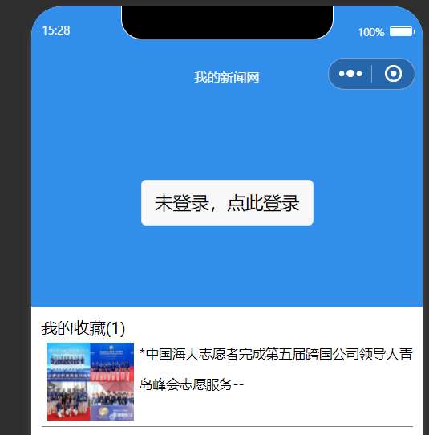

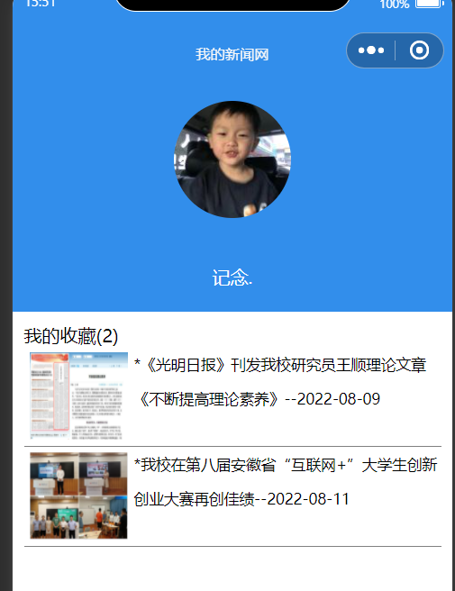

还有一些具体的代码：

```javascript
// pages/my/my.js
var common = require('../../utils/common.js')
Page({

  /**
   * 页面的初始数据
   */
  data: {
    nickName:'未登录',
    src:"/images/index.png",
    newsList:[{
      id:'264698',
      title:'中国海大志愿者完成第五届跨国公司领导人青岛峰会志愿服务',
      poster:'http://news.ouc.edu.cn/_upload/article/images/dd/19/ede76a4a4ebdb1d3ab278a12fdd8/9bb154f8-e33b-421a-b453-82c758a32405.jpg',
      add_data:'2022-03-05'
    }]
  },
  getMyFavorites:function(){
    let info=wx.getStorageInfoSync();
    let keys=info.keys;
    let num=keys.length;
    let myList=[];
    for(var i=0;i<num-1;i++){
      let obj=wx.getStorageSync(keys[i]);
      console.log(myList)
      myList.push(obj);
    }

    this.setData({
      newsList:myList,
      num:num-1
    });
  },
  getMyInfo:function(e){
    console.log(e.detail.userinfo)
    let info=e.detail.userInfo
    this.setData({
      isLogin:true,
      src:info.avatarUrl,
      nickName:info.nickName
    })
    this.getMyFavorites();
  },

  goToDetail:function(e){
    let id=e.currentTarget.dataset.id;
    wx.navigateTo({
      url: '../detail/detail?id='+id,
    })
  },
  /**
   * 生命周期函数--监听页面加载
   */
  onLoad(options) {

  },

  /**
   * 生命周期函数--监听页面初次渲染完成
   */
  onReady() {

  },

  /**
   * 生命周期函数--监听页面显示
   */
  onShow() {
    if(this.data.isLogin){
      this.getMyFavorites()
    }
  },

  /**
   * 生命周期函数--监听页面隐藏
   */
  onHide() {

  },

  /**
   * 生命周期函数--监听页面卸载
   */
  onUnload() {

  },

  /**
   * 页面相关事件处理函数--监听用户下拉动作
   */
  onPullDownRefresh() {

  },

  /**
   * 页面上拉触底事件的处理函数
   */
  onReachBottom() {

  },

  /**
   * 用户点击右上角分享
   */
  onShareAppMessage() {

  }
})
```

```javascript
var common = require('../../utils/common.js')

Page({

  /**
   * 页面的初始数据
   */
  data: {
    //幻灯片素材
    swiperImg: [
      {src: 'http://news.ouc.edu.cn/_upload/article/images/dd/19/ede76a4a4ebdb1d3ab278a12fdd8/9bb154f8-e33b-421a-b453-82c758a32405.jpg'},
      {src: 'https://news.ouc.edu.cn/_upload/article/images/3a/4d/73b22a9b404f93e907238f2a2325/55606b28-53b8-412f-9420-74c7a30657b6.jpg'},
      {src: 'https://news.ouc.edu.cn/_upload/article/images/94/9e/509119874e5287e8c56ef708865b/11604054-e936-468b-a50e-a4233e475a53.jpg'}
    ],
    newsList:[{
      id:'264698',
      title:'中国海大志愿者完成第五届跨国公司领导人青岛峰会志愿服务',
      poster:'http://news.ouc.edu.cn/_upload/article/images/dd/19/ede76a4a4ebdb1d3ab278a12fdd8/9bb154f8-e33b-421a-b453-82c758a32405.jpg',
      add_data:'2022-03-05'
    }]
  },

  /**
   * 生命周期函数--监听页面加载
   */
  onLoad: function (options) {
    let list=common.getNewsList()
    this.setData({newsList:list})
  },
  
  goToDetail:function(e){
    let id = e.currentTarget.dataset.id;
    wx.navigateTo({
      url:'../detail/detail?id=' + id
    })
  },
  /**
   * 生命周期函数--监听页面初次渲染完成
   */
  onReady: function () {
    
  },

  /**
   * 生命周期函数--监听页面显示
   */
  onShow: function () {
    
  },

  /**
   * 生命周期函数--监听页面隐藏
   */
  onHide: function () {
    
  },

  /**
   * 生命周期函数--监听页面卸载
   */
  onUnload: function () {
    
  },

  /**
   * 页面相关事件处理函数--监听用户下拉动作
   */
  onPullDownRefresh: function () {
    
  },

  /**
   * 页面上拉触底事件的处理函数
   */
  onReachBottom: function () {
    
  },

  /**
   * 用户点击右上角分享
   */
  onShareAppMessage: function () {
    
  }
})
```


```javascript
// pages/detail/detail.js
var common=require('../../utils/common.js')
Page({
  addFavorites:function(options){
    let article=this.data.article
    wx.setStorageSync(article.id, article)
    this.setData({isAdd:true}) 
  },
  cancalFavorites:function(){
    let article = this.data.article
    wx.removeStorageSync(article.id)
    this.setData({isAdd:false})
  },
  data: {
    article:{
      id:'264698',
      title:'测试标题',
      poster:'https://news.ouc.edu.cn/_upload/article/images/dd/19/ede76a4a4ebdb1d3ab278a12fdd8/9bb154f8-e33b-421a-b453-82c758a32405.jpg',
      content:'测试测试测试测试测试测试测试测试测试测试测试测试测试测试测试测试测试测试测试测试测试测试测试测试测试测试测试测试',
      add_date:'2024-09-02',
      num:0
    }
  },

  /**
   * 生命周期函数--监听页面加载
   */
  onLoad: function(options) {
    let id=options.id
    var article=wx.getStorageSync(id)
    if(article!=''){
      this.setData({
        article:article,
        isAdd:true
      })
    }
    else{
      let result =common.getNewsDetail(id)
      if(result.code=='200'){
        this.setData({
          article:result.news,
          isAdd:false
        })
      }
    }
  },
  


  /**
   * 生命周期函数--监听页面初次渲染完成
   */
  onReady() {

  },

  /**
   * 生命周期函数--监听页面显示
   */
  onShow() {

  },

  /**
   * 生命周期函数--监听页面隐藏
   */
  onHide() {

  },

  /**
   * 生命周期函数--监听页面卸载
   */
  onUnload() {

  },

  /**
   * 页面相关事件处理函数--监听用户下拉动作
   */
  onPullDownRefresh() {

  },

  /**
   * 页面上拉触底事件的处理函数
   */
  onReachBottom() {

  },

  /**
   * 用户点击右上角分享
   */
  onShareAppMessage() {

  }
})
```


添加完这些代码这个项目就算完美完成了。

## 三、程序运行结果

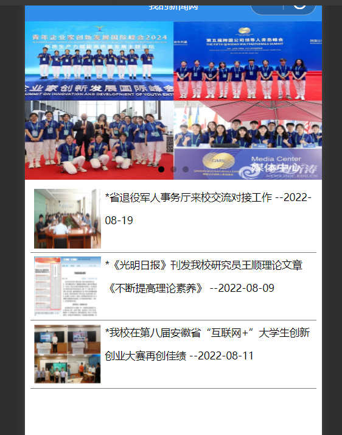

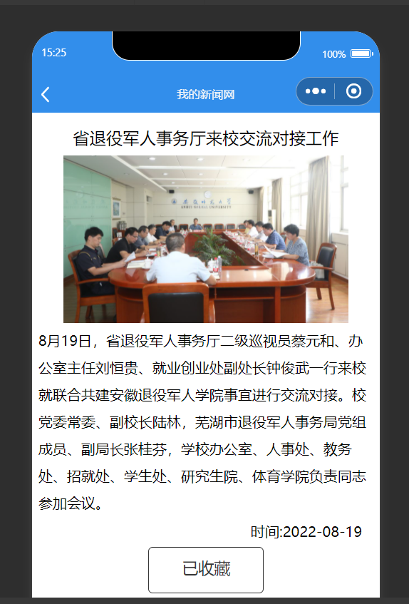


## 四、问题总结与体会

### 问题与解决办法

#### 1. **用户信息获取限制**

 困难：

微信小程序对获取用户信息的权限要求越来越严格，一些新版的微信小程序可能拒绝提供用户的头像和昵称，或者一些函数api已经不能使用，导致程序无法获取用户头像和昵称。

 解决办法：

-  **使用别的办法**：确保使用最新的 API 以符合微信的合规要求。
-  **设计替代方案**：如果用户无法授权头像昵称，可以设计默认头像和昵称，提供基本功能体验，而不影响整体使用。

#### 2. **组件和页面之间的状态管理**

困难：

随着小程序功能的增加，页面之间的数据传递和状态管理可能会变得复杂，特别是在多个页面之间共享状态（如用户登录状态、收藏列表等）。

解决办法：

-  **使用全局数据**：通过 `App` 实例来管理全局状态，这样可以在多个页面之间共享数据。
-  **分离逻辑**：将复杂的逻辑和状态管理拆分到独立的模块或工具类中，保持页面逻辑的简洁性。


#### 3.接口网络信号不好或着存有缓存

困难：接口网络信号不好或着存有缓存，导致无法得到最新的运行结果，比如在授权用户信息的时候，由于缓存导致一直都是之前的错误的结果，耽误开发进度。


解决办法：

-  **切换更好的网络**：使用信号更好的网络，或者在网络信息差的时候停止开发。
-  **定时清理缓存**：定期清理缓存可以保证随时都是最准确的运行结果。


### 收获和体会

#### 1. **技术实践的重要性**

理论学习固然重要，但通过实际动手实践，才能真正理解和掌握技术的应用。通过这个实验，我将所学的微信小程序开发知识运用到实际项目中，从而加深了对各类 API、组件和页面设计的理解。

#### 2. **遇到问题时的解决能力**

在实验过程中遇到了各种问题，如 API 调用失败、页面跳转不成功、用户信息获取受限等。这些问题逼迫我去查找文档、调试代码，并寻找解决方案。这提升了我解决问题的能力，也让我更深刻地认识到文档阅读和资料查找的重要性。

#### 3. **对细节的关注**

在开发过程中，我意识到即使是小的细节，如按钮的位置、加载动画的使用、错误提示的显示等，都可能对最终产品的质量产生很大的影响。通过这个实验，我学会了如何在开发过程中关注和优化这些细节，从而提升整体项目的质量。