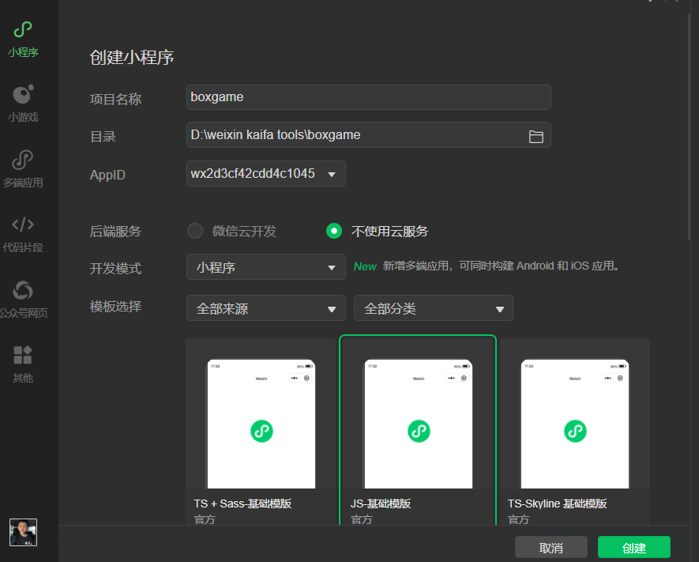
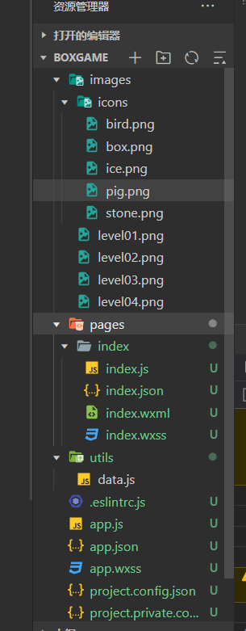
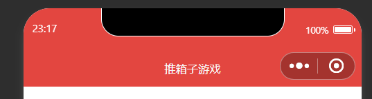
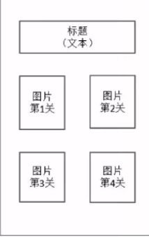
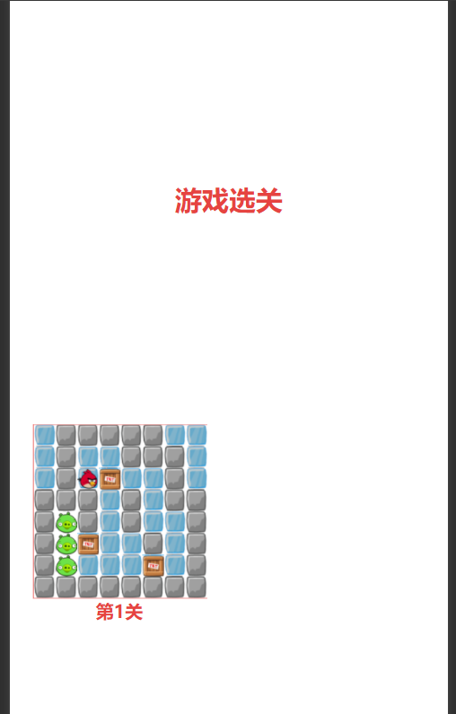
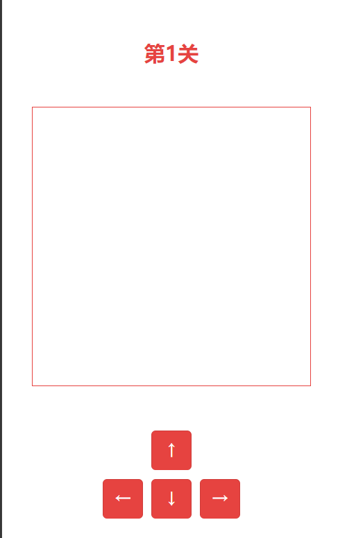
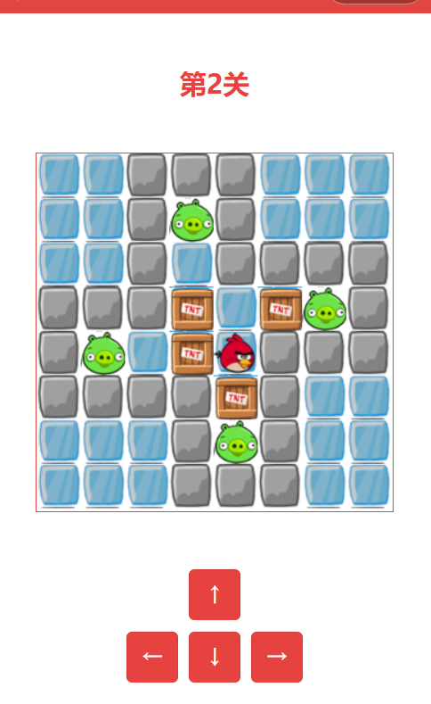
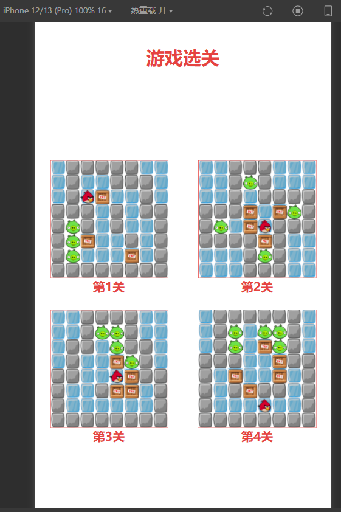
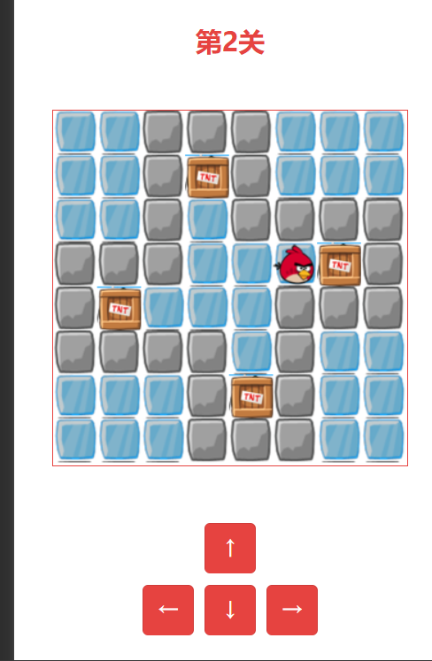
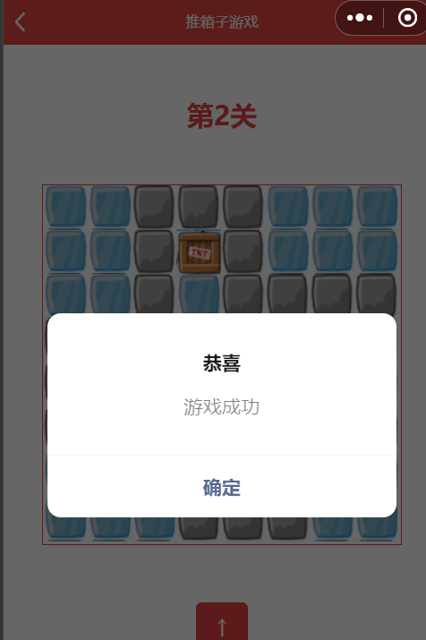

# 2024年夏季《移动软件开发》实验报告


<center>姓名：袁佳俊  学号：22030021099</center>

| 姓名和学号         | 袁佳俊，22030021099                                          |
| ------------------ | ------------------------------------------------------------ |
| 本实验属于哪门课程 | 中国海洋大学24夏《移动软件开发》                             |
| 实验名称           | 实验6：推箱子小游戏                                          |
| 博客地址           | http://t.csdnimg.cn/cB2yU                                    |
| Github仓库地址     | [移动软件开发: 本仓库为2024夏移动软件开发的实验分享仓库 (gitee.com)](https://gitee.com/yuan-jiajunun/mobile-software-development) |


## **一、实验目标**

 1、综合所学知识创建完整的推箱子游戏。

2、能够在开发过程中熟练掌握真机预览、调试等操作。

## 二、实验步骤

### 1.项目创建

首先我们先创建好项目，不使用云服务，不使用模板：



然后我们删除index.js 和index.wxml文件的全部内容，然后我们在app.js文件内输入app，在index.js补全函数page即可，


然后我们需要创建一个文件夹创建一个images还有game文件夹，images里面放上一写些片，图片下载的地址为：

https://gaopursuit.oss-cnbeijing.aliyuncs.com/course/mobileDev/boxgame_images.zip

下载好放入即可

我们还需要创建一个utiles文件夹，里面放入data.js文件，

最后我们得到的页面是这样的：



### 2.导航栏设计

我们在app.json文件中添加这些代码：

```
  "window": {
    "navigationBarTitleText": "推箱子游戏",
    "navigationBarBackgroundColor": "#E34640"
  }
```

然后我们就可以看到导航栏渲染的样子：




我们想设计成这个样式：




所以我们需要先在index.w还有index.wxss文件中添加以下内容：


```html
<view class="container">
  <view class='title'>游戏选关</view>

  <view class='levelBox'>
  <view class="box" wx:for="{{levels}}" wx:key="levels{{index}}" bindtap="chooseLevel" data-level="{{index}}">
    <image src="/images/{{item}}"></image>
    <text>第{{index+1}}关</text>
  </view>
  </view>
    
</view>
```

```html
.levelBox{
  width: 100%;
}

.box{
  width: 50%;
  float: left;
  margin: 20rpx 0;
  display:flex;
  flex-direction: column;
  align-items: center;
}

image{
  width: 300rpx;
  height: 300rpx;
}
```

之后我们就可以看到以下渲染的画面：




### 3.页面设计

但是我们需要的页面图并不是上个图片这样，我们需要把四个关卡的选择交给用户，所以我们需要对此进行一些修改：

在index.wxml还有index.js添加以下内容：

```html
  data: {
    levels:[
      'level01.png',
      'level02.png',
      'level03.png',
      'level04.png'
    ]
  },
```

```html
  <view class="box" wx:for="{{levels}}" wx:key="levels{{index}}" bindtap="chooseLevel" data-level="{{index}}">
    <image src="/images/{{item}}"></image>
    <text>第{{index+1}}关</text>
```

然后就可得到这个样子的样式：


接下来我们设计点击关卡跳转的设计还有每个关卡的样式设计：

在game.wxml添加以下内容：

```html
<!--pages/game/game.wxml-->
<view class="container">
  <view class="title">第{{level}}关</view>

  <canvas canvas-id="myCanvas"></canvas>

  <view class="btnBox">
    <button type="warn" bindtap='up'>↑</button>
    <view>
      <button type="warn" bindtap='left'>←</button>
      <button type="warn" bindtap='down'>↓</button>
      <button type="warn" bindtap='right'>→</button>
    </view>
  </view>

  <button type='warn' bindtap='restartGame'>重新开始</button>
</view>
```

在game.wxss页面添加：

```css
/* pages/game/game.wxss */
canvas{
  border: 1rpx solid;
  width:320px;
  height: 320px;
}

.btnBox{
  display:flex;
  flex-direction: column;
  align-items: center;
}

.btnBox view{
  display: flex;
  flex-direction: row;
}

.btnBox button{
  width: 90rpx;
  height: 90rpx;
}

button{
  margin: 10rpx;
}
```

然后我们就可以得到以下画面：




公共逻辑的实现需要我们在data.js中添加如下数据：

```javascript
var map1 = [
    [0,1,1,1,1,1,0,0],
    [0,1,2,2,1,1,1,0],
    [0,1,5,4,2,2,1,0],
    [1,1,1,2,1,2,1,1],
    [1,3,1,2,1,2,2,1],
    [1,3,4,2,2,1,2,1],
    [1,3,2,2,2,4,2,1],
    [1,1,1,1,1,1,1,1]
  ]
  var map2 = [
    [0,0,1,1,1,0,0,0],
    [0,0,1,3,1,0,0,0],
    [0,0,1,2,1,1,1,1],
    [1,1,1,4,2,4,3,1],
    [1,3,2,4,5,1,1,1],
    [1,1,1,1,4,1,0,0],
    [0,0,0,1,3,1,0,0],
    [0,0,0,1,1,1,0,0]
  ]
  var map3=[
    [0,0,1,1,1,1,0,0],
    [0,0,1,3,3,1,0,0],
    [0,1,1,2,3,1,1,0],
    [0,1,2,2,4,3,1,0],
    [1,1,2,2,5,4,1,1],
    [1,2,2,1,4,4,2,1],
    [1,2,2,2,2,2,2,1],
    [1,1,1,1,1,1,1,1]
  ]
  var map4=[
    [0,1,1,1,1,1,1,0],
    [0,1,3,2,3,3,1,0],
    [0,1,3,2,4,3,1,0],
    [1,1,1,2,2,4,1,1],
    [1,2,4,2,2,4,2,1],
    [1,2,1,4,1,1,2,1],
    [1,2,2,2,5,2,2,1],
    [1,1,1,1,1,1,1,1]
  ]
  module.exports={
    maps:[map1,map2,map3,map4]
  }
  
```

然后我们需要在game.js页面添加内容：

```javascript
var map=[
    [0,0,0,0,0,0,0,0],
    [0,0,0,0,0,0,0,0],
    [0,0,0,0,0,0,0,0],
    [0,0,0,0,0,0,0,0],
    [0,0,0,0,0,0,0,0],
    [0,0,0,0,0,0,0,0],
    [0,0,0,0,0,0,0,0],
    [0,0,0,0,0,0,0,0]
  ]
  var box=[
    [0,0,0,0,0,0,0,0],
    [0,0,0,0,0,0,0,0],
    [0,0,0,0,0,0,0,0],
    [0,0,0,0,0,0,0,0],
    [0,0,0,0,0,0,0,0],
    [0,0,0,0,0,0,0,0],
    [0,0,0,0,0,0,0,0],
    [0,0,0,0,0,0,0,0]
  ]
  var w=40
  var row=0
  var col=0 

data: {
    level:1
  },

  /**
   * 生命周期函数--监听页面加载
   */
  onLoad: function(options) {
    let level=options.level
    this.setData({
      level:parseInt(level)+1
    })
    this.ctx=wx.createCanvasContext('myCanvas')
    this.initMap(level)
    this.drawCanvas()
  },
  
  initMap:function(level) {
    let mapData=data.maps[level]
    for(var i=0;i<8;i++)
    {
      for(var j= 0;j<8;j++)
      {
        box[i][j]=0
        map[i][j]=mapData[i][j]

        if(mapData[i][j]==4){
          box[i][j]=4
          map[i][j]=2
        }else if(mapData[i][j]==5){
          map[i][j]=2
          row=i
          col=j
        }
      }
    }
  },
    drawCanvas:function(){
    let ctx=this.ctx
    ctx.clearRect(0,0,320,320)
    for(var i=0;i<8;i++)
    {
      for(var j= 0;j<8;j++)
      {
        let img='ice'
        if(map[i][j]==1){
          img='stone'
        }else if(map[i][j]==3){
          img='pig'
        }
        ctx.drawImage('/images/icons/'+img+'.png',j*w,i*w,w,w)

        if(box[i][j]==4){
          ctx.drawImage('/images/icons/box.png',j*w,i*w,w,w)
        }
      }
    }
    ctx.drawImage('/images/icons/bird.png',col*w,row*w,w,w)

    ctx.draw()
  },
```

然后就可以发现每个关卡都已经把地图设计出来了：


### 4.逻辑实现

接下来我们需要设计小鸟运动的代码实现，小鸟可以上下左右运动，所以就会包含四个函数：

```javascript
  up:function(){
    if(row>0){
      if(map[row-1][col]!=1 && box[row-1][col]!=4){
        row=row-1
      }
      else if(box[row-1][col]==4){
        if(row-1>0){
          if(map[row-2][col]!=1&&box[row-2][col]!=4){
            box[row-2][col]=4
            box[row-1][col]=0
            row=row-1
          }
        }
      }
      this.drawCanvas()
      this.checkWin()
    }
  },
  down:function(){
    if(row<7){
      if(map[row+1][col]!=1 && box[row+1][col]!=4){
        row=row+1
      }
      else if(box[row+1][col]==4){
        if(row+1<7){
          if(map[row+2][col]!=1&&box[row+2][col]!=4){
            box[row+2][col]=4
            box[row+1][col]=0
            row=row+1
          }
        }
      }
      this.drawCanvas()
      this.checkWin()
    }
  },
  left:function(){
    if(col>0){
      if(map[row][col-1]!=1 && box[row][col-1]!=4){
        col=col-1
      }
      else if(box[row][col-1]==4){
        if(col-1>0){
          if(map[row][col-2]!=1&&box[row][col-2]!=4){
            box[row][col-2]=4
            box[row][col-1]=0
            col=col-1
          }
        }
      }
      this.drawCanvas()
      this.checkWin()
    }
  },

  right:function(){
    if(col<7){
      if(map[row][col+1]!=1 && box[row][col+1]!=4){
        col=col+1
      }
      else if(box[row][col+1]==4){
        if(col+1<7){
          if(map[row][col+2]!=1&&box[row][col+2]!=4){
            box[row][col+2]=4
            box[row][col+1]=0
            col=col+1
          }
        }
      }
      this.drawCanvas()
      this.checkWin()
    }
  },
```

写到这里就可以让小鸟正常的行走，也就完成了这个游戏最重要的一步，接下来我们需要判断小鸟如何做才能游戏结束，在game.js添加以下内容：

```javascript
  isWin:function(){
    for(var i=0;i<8;i++)
    {
      for(var j= 0;j<8;j++)
      {
        if(box[i][j]==4 && map[i][j]!=3){
          return false
        }
      }
    }
    return true 
  },

  checkWin:function(){
    if(this.isWin()){
      wx.showModal({
        title:'恭喜',
        content:'游戏成功',
        showCancel:false
      })
    }
  },
```

然后就可以发现以下画面：


接下来我们设计重新开始的按钮的功能，把地图回退到之前最开始的时候：

```
  restartGame:function(){
    this.initMap(this.data.level - 1)
    this.drawCanvas()
  },
```

然后就可以回退：




到这里我们这个项目也就完美的完成了。


## 三、程序运行结果








## 四、问题总结与体会

### 问题与解决办法


#### 1. **地图未正确绘制**

**问题：** 地图在页面加载后没有正确绘制，或者部分图块未显示。 

**原因可能有以下几点：**

-  `canvas` 元素可能未正确引用，或 canvas 的 `canvas-id` 在js 代码中未正确使用。
-  在 `onLoad` 生命周期函数中，地图初始化未完成或图像资源未加载完毕，导致绘制失败。

**解决办法：**

-  确保 `canvas` 元素的 `canvas-id` 在 `JavaScript` 代码中与 `WXML` 文件中一致。例如，如果在 `WXML` 文件中 `canvas-id` 为 `myCanvas`，则在 JavaScript 中应为 `wx.createCanvasContext('myCanvas')`
-  将地图绘制逻辑放在 `onReady` 函数中，而不是 `onLoad`，确保地图初始化和图像资源加载完成后再进行绘制。


#### 2. **游戏逻辑错误**

**问题：** 游戏逻辑出现错误，例如角色无法正常移动或地图元素未能正确交互。 

**原因：**

-  算法实现可能存在错误，例如角色位置未正确更新，或者碰撞检测未正确处理。
-  数据结构 `map` 和 `box` 未能正确同步更新，导致逻辑错误。

**解决办法：**

-  调试并检查每一步的地图状态和角色位置更新情况，确保逻辑符合预期。
-  在关键逻辑代码处添加 `console.log()` 语句，检查每次地图和角色状态的变化。

#### 3. **按钮交互不灵敏**

**问题：** 控制角色移动的按钮（如上下左右按钮）不灵敏，或者不能正常响应用户点击。

**原因：**

-  按钮事件绑定可能不正确，或者事件处理函数中逻辑错误导致。

**解决办法：**

-  确保每个按钮的 `bindtap` 事件正确绑定了相应的处理函数。
-  在处理函数中，检查是否正确更新了角色的位置和地图状态。


### 收获和体会


#### 1. **对细节的关注**

在做这个实验时，细节处理显得尤为重要。例如，地图的正确绘制、角色的移动逻辑、图像资源的加载等都需要精准把控。如果稍有疏忽，就可能导致整个游戏体验的不连贯或错误。每一个细节的处理都需要经过仔细的调试和验证，这样才能确保游戏能顺利运行

#### 2. **良好的代码结构与模块化设计**

在处理地图绘制、角色移动和游戏逻辑时，合理的代码结构和模块化设计可以极大地提升开发效率和代码的可维护性。通过将地图数据、绘制逻辑、和事件处理分开管理，不仅让代码更加清晰易懂，也便于后续的扩展和调试。

#### 3. **不断学习与自我提升**

在实验过程中遇到的各种挑战，不仅让我学会了如何应对具体的问题，也让我认识到自己的很多不足之处。通过查阅文档、寻求帮助，提升了自己的技术能力和问题解决能力。也让我懂得了游戏类小程序在实现方面和其他小程序的不同之处。