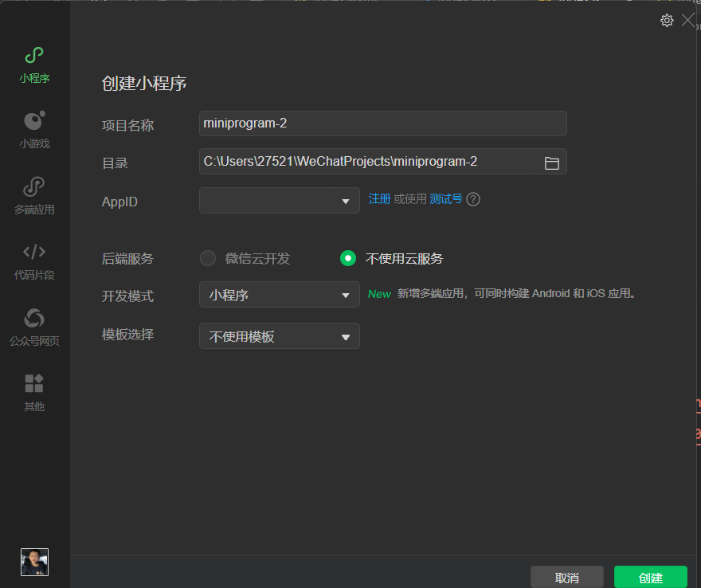
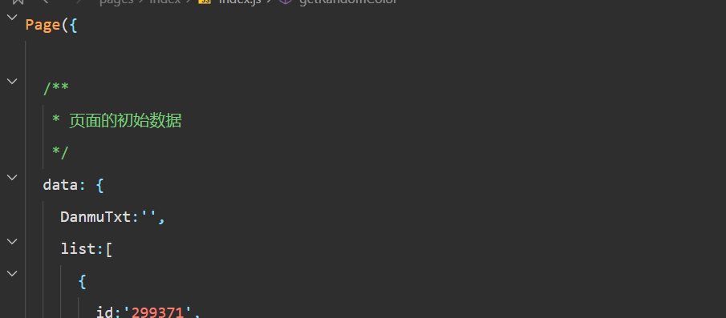
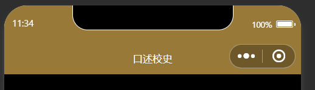
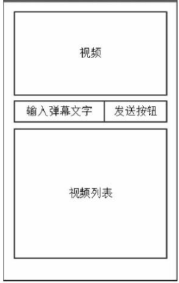
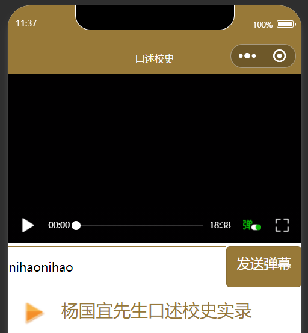
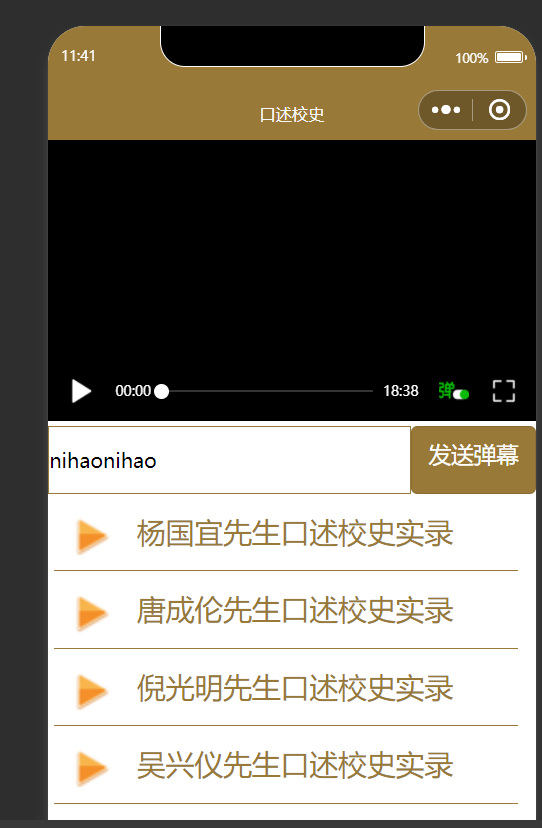
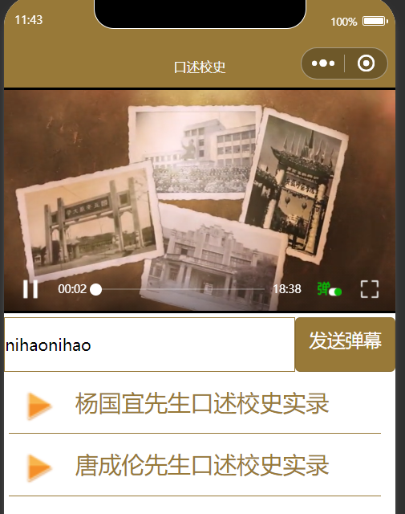
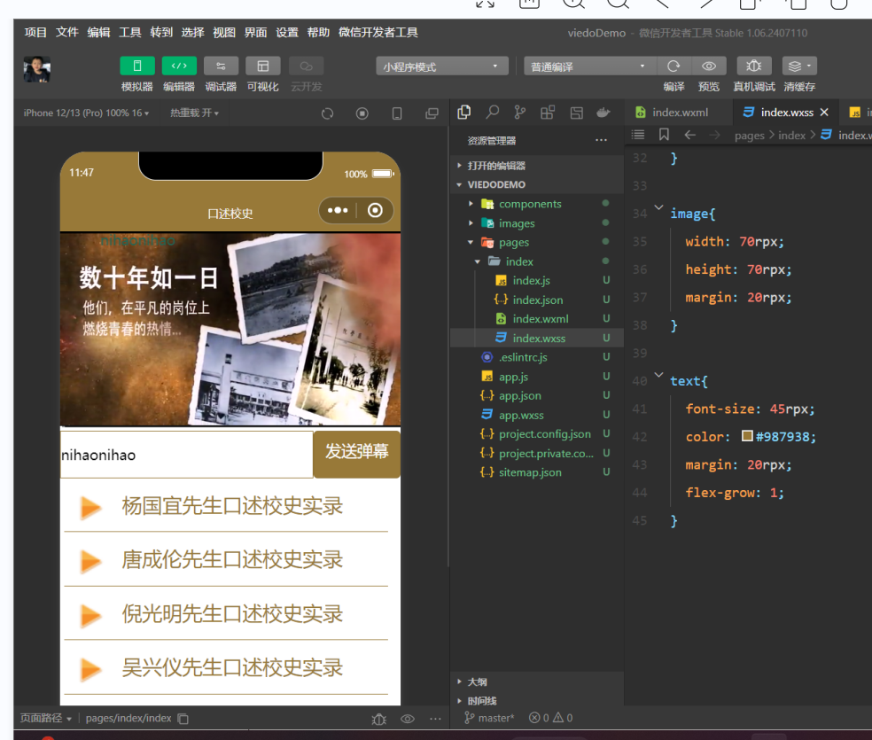

# 2024年夏季《移动软件开发》实验报告


<center>姓名：袁佳俊  学号：22030021099</center>

| 姓名和学号         | 袁佳俊，22030021099                                          |
| ------------------ | ------------------------------------------------------------ |
| 本实验属于哪门课程 | 中国海洋大学24夏《移动软件开发》                             |
| 实验名称           | 实验4：微信小程序视频播放与弹幕                              |
| 博客地址           | http://t.csdnimg.cn/NVL5Z                                    |
| Github仓库地址     | [移动软件开发: 本仓库为2024夏移动软件开发的实验分享仓库 (gitee.com)](https://gitee.com/yuan-jiajunun/mobile-software-development) |


## **一、实验目标**

1、学习不使用模板手动创建小程序的方法。

2.学习使用微信小程序完成视频播放和弹幕发送的工作。


## 二、实验步骤

### 1.项目创建

首先我们先创建好项目，不使用云服务，不使用模板：



然后我们删除index.js 和index.wxml文件的全部内容，然后我们在app.js文件内输入app，在index.js补全函数page即可，



然后我们需要创建一个文件夹创建一个images，里面放上一张图片，图片下载的地址为：

https://gaopursuit.oss-cn-beijing.aliyuncs.com/2022/images_play.zip

下载好放入即可

### 2.视图设计

在app.json文件中加上以上内容：

```javascript
{
  "pages": [
    "pages/index/index"
  ],
  "window": {
    "navigationBarBackgroundColor": "#987938",
    "navigationBarTitleText": "口述校史"
  }
}
```

然后就可以看到小程序的窗口页面变为了：



我们打算做一下这个页面：



所以我们接下来就要往index.wxml文件中加入以下内容：

```javascript
<video id='myVideo'src='{{src}}' controls enable-danmu danmu-btn></video>

<view class='danmuArea'>
  <input type="text" placeholder="请输入弹幕内容" bindinput='getDanmu'></input>
  <button bindtap='sendDanmu'>发送弹幕</button>
</view>

<view class="videoList">
  <view class='videoBar' wx:for='{{list}}'wx:key='video{{index}}' data-url='{{item.videoUrl}}' bindtap='playVideo'>
    <image src="/images/play.png"></image>
    <text>{{item.title}}</text>
  </view>
</view>
```

同时我们需要再index.wxss文件中添加以下内容，增加样式：

```javascript
video{
  width: 100%;
}

.danmuArea{
  display:flex;
  flex-direction:row;
}

input{
  border:1rpx solid #987938;
  flex-grow: 1;
  height:100rpx;
}

button{
  color:white;
  background-color: #987938;
}

.videoList{
  width: 100%;
  min-height: 400rpx;
}

.videoBar{
  width: 95%;
  display: flex;
  flex-direction: row;
  border-bottom: 1rpx solid #987938;
  margin: 10rpx;
}

image{
  width: 70rpx;
  height: 70rpx;
  margin: 20rpx;
}

text{
  font-size: 45rpx;
  color: #987938;
  margin: 20rpx;
  flex-grow: 1;
}
```

这样我们的效果图就会变为：




### 3.逻辑实现

我们增加循环属性：wx：for，改为循环展示列表，所以需要在index.wxml文件中把每个元素改为{{item.name}}

表示，同时还需要在index.js代码补全以下内容：

```javascript
Page({

  /**
   * 页面的初始数据
   */
  data: {
    DanmuTxt:'',
    list:[
      {
        id:'299371',
        title:'杨国宜先生口述校史实录',
        videoUrl:'https://arch.ahnu.edu.cn/__local/6/CB/D1/C2DF3FC847F4CE2ABB67034C595_025F0082_ABD7AE2.mp4?e=.mp4'
      },
      {
        id:'299396',
        title:'唐成伦先生口述校史实录',
        videoUrl:'https://arch.ahnu.edu.cn/__local/E/31/EB/2F368A265E6C842BB6A63EE5F97_425ABEDD_7167F22.mp4?e=.mp4'
      },
      {
        id:'299378',
        title:'倪光明先生口述校史实录',
        videoUrl:'https://arch.ahnu.edu.cn/__local/9/DC/3B/35687573BA2145023FDAEBAFE67_AAD8D222_925F3FF.mp4?e=.mp4'
      },
      {
        id:'299392',
        title:'吴兴仪先生口述校史实录',
        videoUrl:'https://arch.ahnu.edu.cn/__local/5/DA/BD/7A27865731CF2B096E90B522005_A29CB142_6525BCF.mp4?e=.mp4'
      }
    ],

  },

  /**
   * 生命周期函数--监听页面加载
   */
  onLoad: function (options) {
    this.videoCtx=wx.createVideoContext('myVideo')
  },

```

这样我们的界面就会变为：



接着我们再在index.js代码中添加一下函数内容：

```javascript
 playVideo: function(e) {
    console.log('Video URL:', e.currentTarget.dataset.url); // 调试输出
    this.setData({
      src: e.currentTarget.dataset.url
    });
    this.videoCtx.play();
  },
```

然后我们就可以看到以下内容：


这样视频就可以正常播放了

### 4.弹幕实现

我们在index,js文件中添加一下内容：

```javascript
 getDanmu:function(e){
    this.setData({
      danmuTxt:e.detail.value
    })
  },

  sendDanmu:function(e){
    let text=this.data.danmuTxt;
    this.videoCtx.sendDanmu({
      text:text,
      color:getRandomColor()
    })
  },

function getRandomColor(){
  let rgb=[]
  for(let i=0;i<3;++i){
    let color=Math.floor(Math.random()*256).toString(16)
    color = color.length==1?'0'+color:color
    rgb.push(color)
  }
  return '#'+rgb.join('')
}
```

同时在index.wxss界面修改布局：

```javascript

.danmuArea{
  display:flex;
  flex-direction:row;
}

input{
  border:1rpx solid #987938;
  flex-grow: 1;
  height:100rpx;
}

button{
  color:white;
  background-color: #987938;
}
```


然后我们就可以发送彩色的弹幕了，如下图显示：



到这里我们的新项目就算是全部完成啦

## 三、程序运行结果


.png)

.png)

## 四、问题总结与体会

### 问题与解决办法

#### 1. **网络问题**

**困难**：微信小程序的网络连接可能会不稳定，这时候点击视频的时候就不会出现视频画面，或者视频的链接被一些平台保密，无法使用

 **解决办法**：尽量保证在网络好的时候点击视频，以便防止一些问题的发生，使用允许使用的网络链接，就可以避免拒绝访问，同时也可以保证用户的观影体验。

#### 2. **视频播放问题**

**困难**：不同设备和平台可能对视频格式和播放功能支持不一致，可能导致视频无法正常播放或性能不佳。

 **解决办法**：尽量使用主流的、广泛支持的视频格式（如MP4），并在不同的设备上进行测试，确保兼容性。

### 收获和体会

通过实验，我对视频播放机制和弹幕功能的实现有更深的理解，特别是在网络环境和用户互动的复杂场景下，如何确保流畅性和同步性。我也懂得如何在功能和体验之间找到平衡，并根据用户需求做出相应的优化，对弹幕的发送的学习中更加懂得了如何提高用户的观看体验，也更加了解了微信小程序开发的优势和便捷所在，方便以后对这方面的开发。

**解决问题的能力提升**：实验过程中遇到的各种技术挑战，尤其是在调试和优化方面，将提升你的问题解决能力。这不仅有助于技术的积累，也提高了你在面对未知问题时的应对策略。


